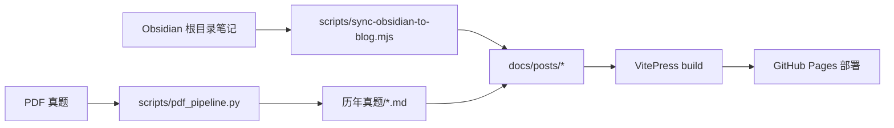

# 仓库依赖图谱与调用关系

> 由扫描脚本自动生成 · 生成日期：2026-08-16
> 用途：帮助 Agent 与开发者快速理解仓库模块结构与调用链路

## scripts/ · Python 脚本依赖

### `bili_fetch.py`
- 标准库: argparse
- 第三方: —
- 函数内局部导入(第三方): —
- 用途: B站(Bilibili)元数据+音频抓取脚本 -- 免登录走官方API。
  2026-09-18 修复：`x/web-interface/view` 已被风控稳定 412，改用 `x/web-interface/wbi/view`（免签名），
  并以 `x/player/pagelist` 兜底；新增字幕轨探测（`x/player/v2`，看 `need_login_subtitle` 判断值不值得登录）。
  外部依赖仅 `ffprobe`（用于时长校验）。
### `embed_video_links.py`
- 标准库: os
- 第三方: —
- 函数内局部导入(第三方): —
- 用途: 把『考点→B站视频』映射嵌入 docs/posts/computer/notes/ 每篇考纲笔记末尾。幂等。
### `embed_video_links_math.py`
- 标准库: os
- 第三方: —
- 函数内局部导入(第三方): —
- 用途: 把『考点→B站视频』映射嵌入 docs/posts/math/notes/ 每篇考纲笔记末尾。幂等。2026-08 实证杰哥170P。
### `fill_abc_exams.py`
- 标准库: pathlib
- 第三方: —
- 函数内局部导入(第三方): —
- 用途: A+B+C 加厚：高数2018/2020全卷、政治多选/材料、计算机2021/2022选项拆解。
### `fill_more_exams.py`
- 标准库: pathlib, re
- 第三方: —
- 函数内局部导入(第三方): —
- 用途: 补全历年真题：高数全卷 + 政治2024单选 + 计算机回忆抽取。
### `pdf_pipeline.py`
- 标准库: argparse, pathlib, re, subprocess, sys
- 第三方: fitz
- 函数内局部导入(第三方): argparse, fitz, numpy, subprocess, tempfile
- 用途: 专升本 PDF/DOCX 分流流水线（本地缓存 → 文本 → 供写 Markdown）

## scripts/ · Node 脚本依赖

### `export-english-embedded.mjs`
- 依赖: node:fs, node:path
### `fill-gaps-from-web.mjs`
- 依赖: node:fs, node:path
### `fill-more-exams.mjs`
- 依赖: node:fs, node:path
### `sync-obsidian-to-blog.mjs`
- 依赖: node:fs, node:path, vitepress

## 外部依赖清单（package.json）

### `darling016123/package.json`
- dependencies:
- devDependencies:
  - `markdown-it-mathjax3@^4.3.2`
  - `vitepress@^1.6.3`

## 数据流 · Obsidian → 网站

