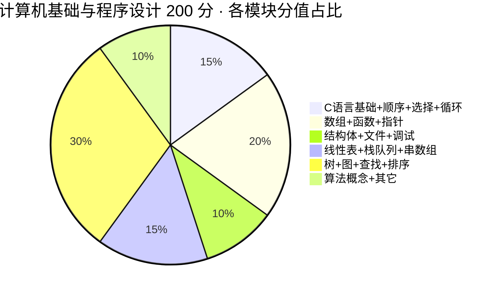

# 2026 考纲全解 · 计算机基础与程序设计（27 届备考基准）

> 🎯 **用途**：你是 **2027 届**。2027 考纲预计 **2026 年 12 月**发布，当前备考以 **2026 考纲**为基准。本页把考纲拆到模块级，供逐章对照学习。
> 📅 数据来源：广东省教育考试院招生规定 + 新东方考纲速览
> 🔗 相关：[计算机专业-报考指南](/guide/计算机专业-报考指南) · [零基础学习路线](/guide/零基础学习路线) · [2026 真题复盘](/posts/computer/2026)

---

## 一、科目定位

| 项目 | 内容 |
|:---|:---|
| 科目全称 | 计算机基础与程序设计（专业综合课·省统考） |
| 满分 | **200 分**（占四科总分 500 分的 **40%**） |
| 时长 | **150 分钟** |
| 考试日期 | **2026 年 3 月 28 日（六）— 29 日（日）两天**，计算机为 29 日下午场 15:00–17:30（27 届以当年通知为准；✅ 已按考试院口径核实） |
| 试卷结构 | 单选 20×3 + 判断 10×2 + 填空 5×4 + 简答 4×10 + 计算 3×10 + 应用 3×10 |

---

## 二、考试范围（官方 21 个模块）

> ✅ **本节的 21 个模块，已逐条对照考试院考纲原文核实**（原文用（一）～（二十一）编号）。
> ⚠️ 旧版本这里只列了 **19 行**，且没有任何说明 —— 原因见本节末尾的「为什么是 19 行」。

### C 语言部分（官方 ①–⑪ · 约一半分值）

| 官方编号 | 模块 | 主要内容 | 对应笔记 |
|:---:|:---|:---|:---|
| ① | 程序设计与 C 语言的基本概念 | 程序结构、算法概念 | [1.1 C语言概述与基本概念](/posts/computer/notes/1.1-C语言概述与基本概念) |
| ② | 数据的存储与运算 | 数据类型、运算符、进制转换 | [1.2 数据的存储与运算](/posts/computer/notes/1.2-数据的存储与运算) |
| ③ | 顺序程序设计 | 顺序结构、基本语句、输入输出 | [1.3 顺序程序设计](/posts/computer/notes/1.3-顺序程序设计) |
| ④ | 选择结构程序设计 | if / switch、逻辑运算 | [1.4 选择结构程序设计](/posts/computer/notes/1.4-选择结构程序设计) |
| ⑤ | 循环结构程序设计 | for / while / do-while、break / continue | [1.5 循环结构程序设计](/posts/computer/notes/1.5-循环结构程序设计) |
| ⑥ | 用数组处理批量数据 | 一维 / 二维、字符数组、字符串函数 | [1.6 数组](/posts/computer/notes/1.6-数组) |
| ⑦ | 用函数实现模块化程序设计 | 定义、调用、参数传递、作用域、递归 | [1.7 函数](/posts/computer/notes/1.7-函数) |
| ⑧ | 指针 | 指针变量、指针与数组 / 函数 / 字符串 | [1.8 指针](/posts/computer/notes/1.8-指针) |
| ⑨ | 用结构体类型处理组合数据 | 结构体、共用体、枚举、typedef | [1.9 结构体与共用体](/posts/computer/notes/1.9-结构体与共用体) |
| ⑩ | 文件 | 文件打开 / 关闭 / 读写 | [1.10 文件操作](/posts/computer/notes/1.10-文件操作) |
| ⑪ | C 程序运行环境与代码调试 | **编译、链接、运行错误的区别（2026 新增）** | [1.11 程序运行环境与调试](/posts/computer/notes/1.11-程序运行环境与调试) |

### 数据结构部分（官方 ⑫–㉑ · 约一半分值）

| 官方编号 | 模块 | 主要内容 | 对应笔记 |
|:---:|:---|:---|:---|
| ⑫ | 数据结构的基本概念 | 逻辑结构、存储结构、ADT | [2.1 数据结构基本概念](/posts/computer/notes/2.1-数据结构基本概念) |
| ⑬ | 线性表 | 顺序表、链表、插入删除、复杂度 | [2.2 线性表](/posts/computer/notes/2.2-线性表) |
| ⑭ | 栈和队列 | LIFO / FIFO、循环队列、应用 | [2.3 栈和队列](/posts/computer/notes/2.3-栈和队列) |
| ⑮ | 串、数组和广义表 | 串存储、KMP、广义表长度深度 | [2.4 串、数组和广义表](/posts/computer/notes/2.4-串、数组和广义表) |
| ⑯ | 树和二叉树 | 二叉树性质、遍历、哈夫曼树 | [2.5 树和二叉树](/posts/computer/notes/2.5-树和二叉树) |
| ⑰ | 图 | 存储、遍历、最小生成树、最短路径 | [2.6 图](/posts/computer/notes/2.6-图) |
| ⑱ | 查找 | 顺序 / 折半查找、哈希 | [2.7 查找](/posts/computer/notes/2.7-查找) |
| ⑲ | 排序 | 插入 / 交换 / 选择 / 归并排序、稳定性 | [2.8 排序](/posts/computer/notes/2.8-排序) |
| ⑳ | 算法的基本概念 | 算法特性、算法与程序的区别 | [2.9 算法基本概念与分析](/posts/computer/notes/2.9-算法基本概念与分析) |
| ㉑ | 算法分析初步 | 时间 / 空间复杂度 | [2.9 算法基本概念与分析](/posts/computer/notes/2.9-算法基本概念与分析) |

### 为什么表里是 19 行而不是 21 行

**不是漏了模块，是本库把两组模块合并了笔记：**

| 官方模块 | 本库处理 | 原因 |
|:---|:---|:---|
| ① + ② | 拆成 [1.1](/posts/computer/notes/1.1-C语言概述与基本概念) 与 [1.2](/posts/computer/notes/1.2-数据的存储与运算) 两篇 | 笔记更细，但旧表把它们压成一行「C 语言基础」 |
| ⑳ + ㉑ | 合成 [2.9 算法基本概念与分析](/posts/computer/notes/2.9-算法基本概念与分析) 一篇 | 内容短，合起来讲更连贯 |

**所以：官方 21 模块 ↔ 本库 19 行表格 ↔ 本库 20 篇笔记，三者对得上，只是口径不同。**
旧版本没有说明这一点，导致「21」和「19」看着像矛盾 —— 这是**表述缺失**，不是内容缺失。

---

## 三、指定教材（✅ 2026-08 官方考纲已核实）

> 来源：广东省教育考试院 2026 统考科目考纲（湛江雅托转载全文，2026-01-05 发布）

| 教材 | 版本 | 出版社 | ISBN |
|:---|:---|:---|:---|
| 谭浩强《C 语言程序设计》 | **第 5 版**（2024 年 8 月） | 清华大学出版社 | 9787302653721 |
| 严蔚敏、吴伟民《数据结构（C 语言版）》 | **第 2 版**（2025 年 10 月） | 清华大学出版社 | 9787302703396 |

> ✅ 教材版本矛盾已解决：官方考纲明确数据结构参考书为 **严蔚敏、吴伟民《数据结构（C 语言版）第 2 版》，清华大学出版社，2025-10**（此前 Sakiko 与新东方两源不一致，现已按官方考纲定版）。

---

## 四、2026 考纲 vs 2024 的变化

| 变化点 | 说明 |
|:---|:---|
| 🆕 单列"程序运行环境与代码调试" | 新增考点 11：理解编译、链接、运行错误区别，会判断错误发生阶段 |
| 🔄 数据结构教材更新 | 严蔚敏《数据结构》更新为 2025 年第 2 版 |
| 试卷结构不变 | 仍为 6 大题、200 分、150 分钟 |

---

## 五、复习优先级（2026 考纲）

| 优先级 | 模块 | 复习目标 |
|:---|:---|:---|
| ⭐⭐⭐ | 控制结构、数组、函数、指针 | 能独立手推和编写完整程序 |
| ⭐⭐⭐ | 线性表、栈、队列、树、图 | 掌握定义、性质和基本操作 |
| ⭐⭐ | 查找、排序、复杂度 | 会写过程、会比较算法 |
| ⭐⭐ | 字符串、结构体、文件 | 掌握常用函数和代码模板 |
| ⭐ | 编译、链接、调试 | 能判断错误发生阶段 |

---

## 七、各模块分值分布与题型对应

> ⚠️ **口径说明（2026-09-17）**：旧标题写「基于 2021-2024 真题统计」，**这个说法站不住**。
> 真实统计源只有 **2021 + 2024 两年、90 题**，而且那份统计**只统计了「考到几次」，没有逐题分值**。
> 下表的「约 X 分」是**按试卷题型分值结构做的估算**（单选 3 分 / 判断 2 分 / 填空 4 分 / 简答 10 分 / 计算 10 分 / 应用 10 分 × 各模块占题数），
> **不是实测值**。用途只有一个：**判断复习优先级**，不要当成精确分值背下来。
>
> 📌 想做精确的分值分布，需要把每道题**逐题标注分值** —— 那是一个独立工程，还没做。
> 现阶段可信的是**次数排序**（见第八节），分值只能给量级。

> 以下统计基于 ForestDeer 完整真题交叉核对

### C 语言部分（约 100 分）

| 模块 | 常考题型 | 分值占比 | 频次 |
|:---|:---|:---:|:---:|
| C 语言基础 | 单选、判断 | 约 10 分 | ⭐⭐⭐⭐⭐ |
| 顺序程序设计 | 单选、填空 | 约 5 分 | ⭐⭐⭐ |
| 选择结构 | 单选、判断、编程 | 约 10 分 | ⭐⭐⭐⭐ |
| 循环结构 | 单选、填空、编程 | 约 15 分 | ⭐⭐⭐⭐⭐ |
| 数组 | 单选、填空、编程 | 约 15 分 | ⭐⭐⭐⭐⭐ |
| 函数 | 单选、简答、编程 | 约 15 分 | ⭐⭐⭐⭐⭐ |
| 指针 | 单选、填空、简答 | 约 10 分 | ⭐⭐⭐⭐ |
| 结构体与共用体 | 单选、判断、简答 | 约 5 分 | ⭐⭐⭐ |
| 文件操作 | 单选、判断 | 约 5 分 | ⭐⭐ |
| 程序运行环境与调试 | 单选、判断 | 约 5 分 | ⭐⭐（2026 新增） |

### 数据结构部分（约 100 分）

| 模块 | 常考题型 | 分值占比 | 频次 |
|:---|:---|:---:|:---:|
| 数据结构基本概念 | 单选、判断 | 约 5 分 | ⭐⭐⭐ |
| 线性表 | 单选、填空、简答 | 约 15 分 | ⭐⭐⭐⭐⭐ |
| 栈和队列 | 单选、填空、简答 | 约 10 分 | ⭐⭐⭐⭐ |
| 串、数组和广义表 | 单选、填空 | 约 5 分 | ⭐⭐⭐ |
| 树和二叉树 | 单选、填空、计算 | 约 15 分 | ⭐⭐⭐⭐⭐ |
| 图 | 单选、填空、计算 | 约 10 分 | ⭐⭐⭐⭐ |
| 查找 | 单选、填空、计算 | 约 10 分 | ⭐⭐⭐⭐ |
| 排序 | 单选、填空、计算 | 约 10 分 | ⭐⭐⭐⭐ |
| 算法概念与分析 | 单选、判断 | 约 5 分 | ⭐⭐⭐ |

> 📌 C 语言约 100 分（占 50%），数据结构约 100 分（占 50%）。**核心砍分点**：指针/数组/函数 + 树/图/排序。

---

## 八、历年高频考点 TOP 15

> ⚠️ **口径更正（2026-09-17）**：旧标题写「2021-2024 真题统计」，**这个说法是错的**。
> 真实统计源 `资料/高频考点统计/计算机-高频考点TOP20.md` 的样本是
> **2021 + 2024 两套真题、共 90 题**（该文件自己写明了范围）。
> 所以下表「出现次数」一列的**分母只有 2 年**，不是 4 年 —— 请按「2 年样本」理解，**不要据此押题**。

| 排名 （按实测次数） | 考点 | 出现次数 （90 题样本） | 最近出现 |
|:---:|:---|:---:|:---:|
| 1 | 运算符优先级 | 9 次 / 90 题 | 2023 |
| 2 | 函数的定义与调用 | 8 次 / 90 题 | 2024 |
| 3 | 字符串函数（strlen/strcpy） | 6 次 / 90 题 | 2024 |
| 4 | 循环结构（for/while 运行结果） | 5 次 / 90 题 | 2024 |
| 5 | 指针与数组的关系 | 5 次 / 90 题 | 2024 |
| 6 | 二叉树的性质与遍历 | 5 次 / 90 题 | 2024 |
| 7 | 栈和队列的特性 | 5 次 / 90 题 | 2024 |
| 8 | 图的遍历与存储 | 5 次 / 90 题 | 2023 |
| 9 | 数组的定义与使用 | 4 次 / 90 题 | 2024 |
| 10 | 线性表的插入删除 | 4 次 / 90 题 | 2024 |
| 11 | 时间复杂度分析 | 4 次 / 90 题 | 2024 |
| 12 | 折半查找 | 3 次 / 90 题 | 2024 |
| 13 | 排序算法（冒泡/选择/插入） | 2 次 / 90 题 | 2024 |
| 14 | 结构体的定义与使用 | 2 次 / 90 题 | 2024 |
| 15 | 文件操作 | 2 次 / 90 题 | 2023 |

---

## 九、备考时间分配建议（零基础，8-12 周）

| 阶段 | 周数 | 重点 | 目标 |
|:---|:---:|:---|:---|
| 基础入门 | 第 1-2 周 | C 语言基础、顺序/选择/循环结构 | 能看懂简单程序 |
| C 语言进阶 | 第 3-4 周 | 数组、函数、指针 | 能独立编写简单程序 |
| C 语言深入 | 第 5 周 | 结构体、文件操作、调试 | 掌握 C 语言全部考点 |
| 数据结构入门 | 第 6-7 周 | 线性表、栈、队列、串 | 理解基本数据结构 |
| 数据结构进阶 | 第 8-9 周 | 树、图、查找、排序 | 掌握重难点 |
| 综合复习 | 第 10 周 | 综合练习、改错题 | 查漏补缺 |
| 真题冲刺 | 第 11-12 周 | 2021-2024 真题反复练 | 适应考试节奏 |

---

## 十、2027 考纲预测

> 基于 2024→2026 的变化趋势，2027 考纲预计：

| 方面 | 预测 | 置信度 |
|:---|:---|:---:|
| 试卷结构 | 不变（6 大题 200 分 150 分钟） | 极高 |
| C 语言部分 | 考点不变，可能微调表述 | 高 |
| 数据结构部分 | 可能新增 1-2 个考点（如 B 树、平衡二叉树） | 中 |
| 教材版本 | 数据结构教材**已按官方考纲确认**：严蔚敏、吴伟民《数据结构（C 语言版）》第 2 版，清华大学出版社 2025-10 | 高 |
| 新增考点 | 可能继续强化"程序调试"相关内容 | 中低 |

> 最终以 2026 年 12 月发布的官方考纲为准。以上预测仅作备考参考，不要因等考纲而停学习。

---

## 资料来源

- [广东省 2026 年普通高等学校专升本招生工作规定（PDF）](https://zhaosheng.szpu.edu.cn/UploadFiles/news/2025/4802287.pdf) ⚠️ **该链接 2026-08 核实已失效**（考试院官网当前不可达）
- ✅ [2026《计算机基础与程序设计》官方考纲全文（湛江雅托转载考试院版）](https://www.zjielts.com/newsinfo/8905126.html)（2026-01-05，含 21 模块 + 教材 ISBN + 试卷结构）
- ✅ [2026《高等数学》官方考纲全文（湛江雅托转载考试院版）](https://www.zjielts.com/newsinfo/8902862.html)（2026-01-04，含 12 模块 + 试卷结构）
- ✅ [2026《政治理论》官方考纲全文（湛江雅托转载考试院版）](https://www.zjielts.com/newsinfo/8902773.html)（2026-01-04）
- [2026 年广东专升本《计算机基础与程序设计》考纲速览（新东方）](https://zsb.xdf.cn/202602/15098417.html)（✅ 已核实可达）
- 本站：[计算机程序设计系统笔记](/posts/computer/notes/)

> **核实说明（2026-08）**：本页考纲范围（21 模块）、教材版本（谭浩强第 5 版 + 严蔚敏《数据结构》第 2 版 2025-10）、考试日期（3 月 28–29 日）均已按考试院口径（湛江雅托转载官方考纲全文）核验；2027 考纲仍以 2026 年 12 月发布为准。
