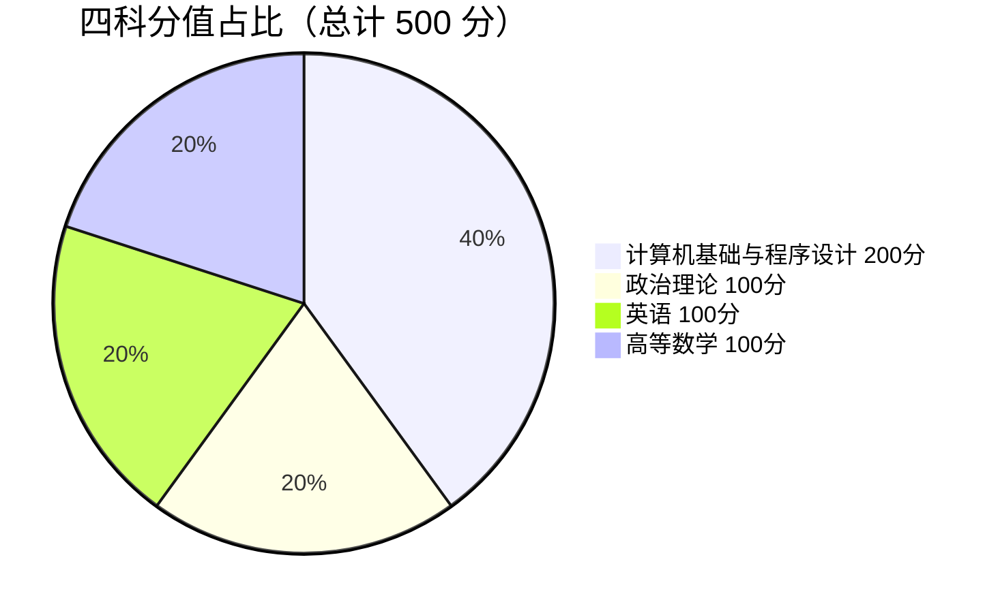

# 计算机类专业报考指南（公办线 · 2027 届定位）

> 🎯 用途：你是 **2027 届、大专读计算机、目标公办本科**，本章把你的赛道、科目、投档分数一次讲清。
> 📅 数据来源：省考试院省控线 + 各院校官方投档线（**2026 年实测**，2025 作对照）
> 🔗 相关：[省控线](/guide/省控线-录取分数线) · [公办院校](/guide/公办院校与录取) · [真题考频矩阵](/guide/真题考频矩阵)

---

## 一、考试科目（计算机类确定）

计算机/软件/大数据等信息类公办专业，走 **高等数学** 专业基础课赛道，四科构成：

| 科目 | 类别 | 分值 |
|:---|:---|:---:|
| 政治理论 | 公共课 | 100 |
| 英语 | 公共课 | 100 |
| **高等数学** | 专业基础课 | 100 |
| **计算机基础与程序设计** | 专业综合课（省统考） | 200 |
| **合计** | | **500** |

> 📌 **专业综合课 200 分占 40%**——单科最大权重，是拉开差距的关键。

> 三科总分线 = 政治 + 英语 + 高数 = 300 分口径。
> 高数省控线 2026 年为 **105 / 综合 60**（9 类最低挡，易过线，但高分扎堆）。

---

## 二、公办计算机院校与投档线（2026 实测）

公办计算机**实际录取在 408–424**，远超省控线（三科 105 / 专综 60），竞争激烈：

| 公办院校 | 专业 | 2026 最低分 | 平均分 | 最低排位 | 备注 |
|:---|:---|:---:|:---:|:---:|:---|
| 韩山师范学院 | 计算机科学与技术 | **424** | 434.06 | 112 | 与广东科学技术职业学院协同培养 2+0 |
| 嘉应学院 | 计算机科学与技术 | **413** | — | 202 | 普通批，录取 42 人 |
| 韩山师范学院 | 软件工程 | **411** | 419.37 | 240 | 与广东食品药品职业学院协同培养 |
| 韩山师范学院 | 数据科学与大数据技术 | **408** | 414.56 | 270 | 协同培养 |
| 韩山师范学院 | 电子信息工程 | 407 | 422.33 | 147 | 协同培养 |
| 韩山师范学院 | 电气工程及其自动化 | 410 | 424.40 | 126 | 协同培养 |

> ⚠️ **关于「协同培养 2+0」**：韩山师范学院 2026 年 27 个招生专业中有 20 个是协同培养项目，**办学地点在对应的高职院校**（如广东科学技术职业学院），不在本科校本部。优点是投档分相对同层次普通专业低、名额较多；缺点是就读地点需自行确认。这是每年争议最多的点。

### 2026 年民办计算机类投档线（对照）

| 院校 | 专业 | 最低分 | 平均分 | 最低排位 |
|:---|:---|:---:|:---:|:---:|
| 广州软件学院 | 计算机科学与技术 | 353 | 372 | 1143 |
| 广州软件学院 | 软件工程 | 334 | 350 | 1569 |
| 广州软件学院 | 物联网工程 | 313 | 333 | 2139 |
| 广东科技学院 | 网络工程 | 313 | 340 | 2137 |
| 广东科技学院 | 网络空间安全 | 304 | 349 | 2412 |
| 广东科技学院 | 物联网工程 | 286 | 311 | 2979 |
| 广东科技学院 | 软件工程 | 285 | 307 | 3022 |
| 广州理工学院 | 计科 / 网工 / 软工 / 大数据（同专业组） | 280 | — | 3198 |

> 📌 **民办院校的三种投档模式**：① 按专业单独投档（如广州软件学院，计科 353 / 软工 334，分差明显）；② 按专业组打包投档（如广州理工学院，四个计算机专业共用 280 的最低分，组内可调剂）；③ 冷门方向单独低分（如数字媒体技术 206）。这意味着**同样考 280 分，报 A 校只能进冷门专业，报 B 校可能进计科——择校策略的权重不低于分数本身。**

> 完整以当年《广东省普通高等学校专升本招生专业目录》为准。

---

## 三、对 2027 届（考公办计算机）的核心含义

1. **冲 415+ 才稳**：2026 年公办计算机实际录取在 **408–424**，你要 **四科总分卷到 415+** 才可能进热门公办（省控线只是入场券）。
2. **高数是分水岭**：计算机一律考高数专业基础课（105/60 最低挡），过线容易但**高分考生最多**——政治/英语/高数三科要往 85+ 冲。
3. **专业综合课 200 分是大头**：`计算机基础与程序设计` 单科 200 分占 40%，是拉开差距和保住总分的关键，规划里权重最高。
4. **公办院校数在增，但计算机名额仍稀缺**：2026 年公开汇总口径下公办招生院校增至约 10 所（2025 约 6 所），新增韶关学院、岭南师范学院、广东第二师范学院、深圳职业技术大学等。但计算机类在公办中仍属稀缺专业，**竞争烈度没有下降**。宜早定目标校。
5. **注意职业本科通道**：「计算机应用工程」「网络工程技术」「软件工程技术」「大数据工程技术」等职业本科专业代码不同（31xxxx），同样考「计算机基础与程序设计」，但竞争烈度通常低于普通本科同名专业。是一条被低估的路径。

---

## 四、2027 届报考动作

1. 定 2–3 个目标公办校（关注 2027 最新专业目录：哪些校招、哪些退出，参考公办页的进退变化）。
2. 按 [真题考频矩阵](/guide/真题考频矩阵) 分配精力：**数组 35.5 分 + 循环 29 分 = 32% 的卷面分值**，是投入产出最高的部分；树图查找排序合计仅 9.75%，控制投入。
3. 刷 2021–2024 真题，重点补 **2025、2026 计算机基础与程序设计**（现状：2026 有整理版，2025 为题型确认，无完整整卷）差距。
4. 按**目标校历年录取排位**定位，不是按省控线。2026 年公办计算机最低排位在 **112–270** 区间，民办在 **1143–3249**。
5. **2026 年 11–12 月**考纲与招生简章发布时，逐校核对前置专业要求与招生计划——这决定目标校是否需要更换。

---

## 五、录取数据如实边界

- 上表为 **2026 年**各院校官方发布的投档线（2025 数据保留作趋势对照），2027 校线以省考试院 2027 投档线为准（预计 2027.5 公布）。
- 计算机 2025 真题公开网暂无完整整卷，本页不编造题目，缺口与补充渠道见 [资料来源与使用说明](/guide/sources)。
- 「协同培养」项目的办学地点以院校招生简章为准，本页不代为判断。

---

> 相关：[省控线](/guide/省控线-录取分数线) · [公办院校](/guide/公办院校与录取) · 真题总索引（源库文件，站点未发布版）