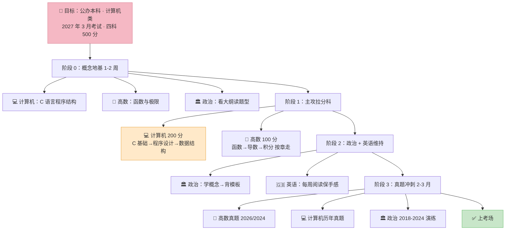

# 🎯 0 基础学习路线（公办计算机赛道）

::: tip 本页的位置
**主入口已经搬到 [0 基础总入口](/guide/零基础总入口)** —— 那里有唯一一条路线、"现在学到哪"、以及零基础讲义索引。
本页是它的**展开版**（保留 Mermaid 流程图，适合打印贴墙）。**两页冲突时以总入口为准。**
:::

> 你已经定下目标：**考广东公办本科 · 计算机类**。这条路线专为**除英语外全科目 0 基础**的考生排布——不堆真题，先建立概念骨架，再进入刷题。

---

## 一、先认清考什么（4 门 500 分）

| 科目 | 分值 | 题型门槛 | 对应本站笔记 |
|:---|:---:|:---|:---|
| 政治理论（公共课） | 100 | 选择题送分，材料题需背 | [系统笔记](/posts/politics/notes/) |
| 英语（公共课） | 100 | 你有基础，维持+背作文模板 | [真题](/posts/english/) |
| **高等数学**（专业基础课） | 100 | **0 基础最大坎，需按顺序学** | [章节笔记](/posts/math/notes/) |
| **计算机基础与程序设计**（专业综合课） | **200** | 单一科占 40%，最拉分 | [系统笔记](/posts/computer/notes/) |

> ⚠️ 200 分那门占五分之二。0 基础优先攻它的**章节基础**，性价比最高。

---

## 二、推荐学习顺序（0 基础版）

### 阶段 0：先搭好概念地基（约 1–2 周，三科并行打底）
> 不要一上来刷题。先建立每科的「语言」。

| 科目 | 入门动作 | 入口 |
|:---|:---|:---|
| 计算机 | 先理解 C 语言程序结构，别碰指针/函数 | [1.1 C语言概述](/posts/computer/notes/1.1-C语言概述与基本概念) |
| 高数 | 先学函数与极限（一切的地基） | [1.1 函数概念](/posts/math/notes/1.1-函数的概念) |
| 政治 | 先读大纲，了解题型分值，不要背 | [00 考试大纲](/posts/politics/notes/00-考试大纲与题型) |

### 阶段 1：计算机 + 政治 先跑（回报最快）
- **计算机（200 分）**：C 语言 → 程序设计 → 数据结构，按笔记章节顺序：
  - C 基础：[1.1](/posts/computer/notes/1.1-C语言概述与基本概念) → [1.3 顺序](/posts/computer/notes/1.3-顺序程序设计) → [1.4 选择](/posts/computer/notes/1.4-选择结构程序设计) → [1.5 循环](/posts/computer/notes/1.5-循环结构程序设计) → [1.6 数组](/posts/computer/notes/1.6-数组) → [1.7 函数](/posts/computer/notes/1.7-函数)
  - 数据结构（进阶）：[2.1 基本概念](/posts/computer/notes/2.1-数据结构基本概念) → [2.2 线性表](/posts/computer/notes/2.2-线性表) → [2.3 栈队列](/posts/computer/notes/2.3-栈和队列) → [2.5 树](/posts/computer/notes/2.5-树和二叉树)
- **高数**：按章号顺序 [第一章 函数与极限](/posts/math/notes/) → 第二章微分 → 第三章积分，**一步步过**，别跳。

### 阶段 2：政治（学概念 → 背模板）
- 学：[01](/posts/politics/notes/01-马克思主义中国化时代化) → [02 毛泽东思想](/posts/politics/notes/02-毛泽东思想) → … → [10 中国式现代化](/posts/politics/notes/10-中国式现代化)
- 背：[17 辨析论述模板](/posts/politics/notes/17-辨析论述材料题模板) + [18 必背金句](/posts/politics/notes/18-必背金句与名词)

### 阶段 3：真题 → 真题 → 真题（最后 2–3 月）
- **高数**：优先 [2026 全卷详解](/posts/math/2026) + [2024](/posts/math/2024)
- **计算机**：→ [历年真题](/posts/computer/)
- **政治**：[2018–2024 演练](/posts/politics/)

---

## 一·五、学习路线总览图（Mermaid）

> 💡 图上顺序 = 推荐学习顺序；每科内部再按章节链条推进（高数不能跳章）。

### 思维导图（可打印版）

> 图片由 `scripts/gen-roadmap.py` 生成，可打印贴墙。修改配色/文案后重跑脚本即可更新。

---

## 三、章节笔记总入口（按需点开）

- 高数：[章节笔记总览](/posts/math/notes/)
- 计算机：[C 语言 + 数据结构](/posts/computer/notes/)
- 政治：[大纲 + 系统笔记](/posts/politics/notes/)

> 📌 这里**故意不写"共 N 篇"**——篇数每加一篇就过期一次，看页面里的实际列表最准。

---

## 四、给你的 0 基础提醒

1. **高数不能跳**：函数→极限→导数→积分是硬链条，顺序错会卡死。
2. **计算机抓 200 分**：专业综合课占 40%，C 语言基础题 + 数据结构概念题是拿分大头。
3. **政治不靠硬背**：理解框架 + 用模板写，比逐字背快得多。
4. **英语别掉**：不是 0 基础，每周维持 1–2 套阅读就能保持手感。

> 具体每章考点与练习，直接点开对应笔记页，页内附 **闭卷挑战** 题目自测。

---

## 五、为什么这样排

> ⚠️ **本节已更正**：旧版本这里放过一张「三种复习策略实测对比」箱线图，图上标着 `ANOVA F=24.5, p<0.001, n=15/组`。
> 那些数字是**用脚本生成的示意数据，不是真实实验**——已撤下。
> 拿模拟数据冒充实测结论，本身就是在教人"看着科学的数字可以信"，这与本站"凡数字必有凭据"的规矩相反。

下面三条是认知科学里最稳的学习原理，**只引用结论方向，不编造具体数字**：

| 原理 | 一句话 | 在本站怎么落地 |
|:---|:---|:---|
| **提取练习** | 先自己回想 / 作答，再看答案，比反复阅读有效得多 | 每章页内的「闭卷挑战」；做题安排在讲解之前 |
| **间隔重复** | 同样的总时长，分散到多天比集中在一天记得牢 | 笔记 → 闭卷挑战 → 隔日回顾；Anki 负责词与错题 |
| **交错练习** | 混着练不同题型，比一类题连做到底更能迁移 | 真题 + 考点拆分 + 专项，混合着刷 |

> 📌 **为什么删掉那张图**：图上标着显著性检验的 P 值，看着像研究结论，实际是按设定参数生成的。
> **如果一个数字连"它从哪来"都答不上，它就不该出现在一份教人怎么学的页面上。**
>
> 📚 想要真实依据，自行检索这三个关键词：`testing effect`（Roediger & Karpicke）、
> `spacing effect`（Cepeda 等）、`interleaving`（Rohrer & Taylor）。

## 源自
- 本站各科系统笔记均为真实公开考纲整理（详见 [资料边界](/guide/sources)）。
- 本页仅做**学习顺序编排**，不新增题目。