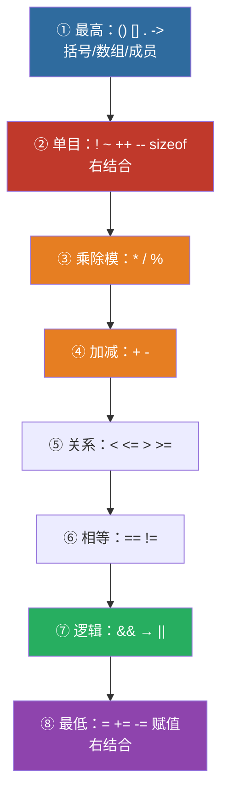

# 1.2 数据的存储与运算

> 🎯 **一句话记住**：数据类型决定了数据在内存中占多少空间、怎么存、能做什么运算；运算符则是告诉计算机"这些数据要怎么算"的指令符号。

---

## ① 这一章在考试里怎么出现

常以**单项选择题、判断题、填空题**的形式出现，也常和后面的章节合在一起出计算题或读程序题。
具体分值每年浮动，不做预估；本笔记只按「理解 + 会做题」的标准讲。

### 真题实际打在哪（2021 · 2022 · 2024 · 2026 四年 12 题）

> **口径**：只统计真题原文里带 `[[1.2 数据的存储与运算]]` 标签的题；
> 每题只归**一类**（按解析的重点归），所以合计正好 12。
> 2018–2020、2023、2025 五年原文没有标签，未计入 —— **空白是「没标注」，不是「没考」。**
> 分类是本库整理的，**不是官方考纲分类**。

| 子考点 | 出现 | 年份 · 题号 | 笔记位置 |
|:---|:--:|:---|:---|
| **逻辑 / 关系运算的返回值** | **4** | 2021单选1 · 2021单选2 · 2022单选2 · 2024单选4 | §3.5.4 · §3.5.10 |
| **整数除法与取余** | **4** | 2021单选3 · 2024单选5 · 2024计算2 · 2026单选1 | §3.5.2 · §3.5.9 |
| **强制类型转换的时机** | 1 | 2022单选8 | §3.5.11 |
| **逗号表达式** | 1 | 2024单选7 | §3.5.6 |
| **自增自减 / 未定义行为** | 1 | 2026单选2 | §3.5.3 |
| **赋值表达式的值** | 1 | 2024单选3（⚠️ 题面存疑，见下）| §3.5.12 |

> 📌 **最该先练的两个**：「逻辑/关系运算的返回值」和「整数除法与取余」各占 **4 题**，
> 加起来是这一章的三分之二。而它们恰好都是「**读得懂符号、但算错结果**」的类型 ——
> 这两块吃透，1.2 就基本拿满了。

#### ⚠️ 关于 2024 单选3：这道题的题面可能记错了

真题原文：`int a=1,b=0; printf("%d", b=a+b); printf("%d", a=2-b);`，选项 A `1,0` / B `1,2` / C `3,2` / D `0,0`。

本机 gcc 实测（16.2.0）：

| 代码 | 实测输出 | 对得上选项吗 |
|:---|:---:|:---|
| 按原文 `a = 2 - b` | `[1][1]` → **11** | ❌ 四个选项都没有 |
| 若第二式是 `a = 2 * b` | `[1][2]` → **12** | ✅ 正好是选项 B |

**结论**：这道回忆版大概率把 `2 * b` 记成了 `2 - b`。
**刷题重点不在答案，在这句话** —— **赋值本身是一个表达式，它有值，可以直接当 `printf` 的实参**。
`printf("%d", b = a + b)` 是合法写法，会先算 `a+b`、赋给 `b`、再打印 `b` 的新值。

## ② 🗣️【零基础大白话引入】

**运算符是什么？** 想象你是一个厨师，**数据就是食材**（土豆、牛肉、鸡蛋），而**运算符就是厨房里的工具**（菜刀、锅、搅拌器）。没有工具，食材只能堆着；有了工具，你才能"切"（运算）、"煮"（运算）、"炒"（运算），最终做出一道菜（**表达式的值**）。

**举个例子**：
- `3 + 5`：`+` 就是"加法工具"，把 3 和 5 两个数字"炒"在一起，出锅一盘 `8`。
- `7 / 2`：`/` 是"除法工具"。注意！在 C 语言厨房里，两个**整数**相除，锅会**直接丢掉小数部分**——`7 / 2` 出来的是 `3`，不是 `3.5`！这就像做"整数份"的菜，7 个苹果 2 人分，每人只能拿 3 个整的，剩下的 1 个就是 `7 % 2`（取余）——**% 就是"分剩几个"的工具**。
- `a++`：`++` 是"计数器工具"，每次用完食材后自动把"库存数"加 1。

**学完能解决什么问题？**
1. 看懂真题选择题里"这个表达式值是多少"——直接白拿 3~6 分
2. 写程序时正确地让计算机算数（判断、循环、累加都离不开它）
3. **避开最大的坑**：知道什么时候"算出来的答案是骗人的"（未定义行为）——2026 真题专门考了这个

> 💡 记住：**C 语言里一切都是"表达式"，表达式的最终结果是"一个值"**。本章就是教你：拿到一串符号，怎么一步步算出那个"值"。

---

## ③ 📖【正式核心知识点讲解】

> 本章知识点 = 考纲要求 + 历年真题实际考过的内容。真题从未考察、考纲不作要求的内容已剔除（如位运算的复杂应用仅保留了解级）。

### 3.1 数据类型全家福（先认识"食材"）

```
C数据类型
├── 基本类型
│   ├── 整型：int, short, long, long long
│   ├── 字符型：char（本质是整型）
│   ├── 浮点型：float, double
│   └── 布尔型：_Bool（C99新增）
├── 构造类型
│   ├── 数组
│   ├── 结构体 struct
│   ├── 共用体 union
│   └── 枚举 enum
├── 指针类型：*
└── 空类型：void
```

### 3.2 整型数据（重点）

#### 整型分类

| 类型 | 关键字 | 字节数(32位) | 取值范围 |
|:---|:---|:---:|:---|
| 基本整型 | `int` | 4 | $-2^{31} \sim 2^{31}-1$ |
| 短整型 | `short` | 2 | $-32768 \sim 32767$ |
| 长整型 | `long` | 4 | $-2^{31} \sim 2^{31}-1$ |
| 长长整型 | `long long` | 8 | $-2^{63} \sim 2^{63}-1$ |
| 无符号整型 | `unsigned int` | 4 | $0 \sim 2^{32}-1$ |

#### ⚠️ 易错点
> `sizeof(int)` 在不同的编译器中**可能不同**——16位系统是2字节，32/64位系统是4字节
> 但考试默认：**int占4字节，short占2字节**

#### 有符号 vs 无符号

```c
signed int a = -10;   // 可以存负数（最高位表示符号）
unsigned int b = 10;  // 只能存正数（最高位参与数值）
```

**存储方式：**
- 正数：**原码**直接存储
- 负数：**补码**存储（原码→取反→加1）

| 数值 | 原码 | 反码 | 补码 |
|:---|:---:|:---:|:---:|
| +5 | 0000 0101 | 0000 0101 | 0000 0101 |
| -5 | 1000 0101 | 1111 1010 | 1111 1011 |

#### 💡 常用技巧
> **为什么负数用补码存储？**
> 因为可以让**加减法用同一套电路**实现！
> 例：$3 + (-2) = 0000\ 0011 + 1111\ 1110 = 1\ 0000\ 0001$ → 溢出舍去→ `0000 0001 = 1` ✅

### 3.3 字符型数据

```c
char ch = 'A';        // 字符用单引号
printf("%c", ch);     // 输出字符 → A
printf("%d", ch);     // 输出ASCII码 → 65
```

#### 常见ASCII码（必须背！）

| 字符 | ASCII码(十进制) |
|:---|:---:|
| `'0'` | 48 |
| `'A'` | 65 |
| `'a'` | 97 |
| `'\n'` | 10（换行） |
| `'\0'` | 0（字符串结束标志）|

#### ⚠️ 易错点
> `'0'` ≠ 0 ≠ `'\0'`
> `'0'` = ASCII 48, `0` = 整型0, `'\0'` = ASCII 0（字符串结束符）
> 大小写转换：`'A' + 32 = 'a'` ✅

### 3.4 浮点型数据

| 类型 | 字节 | 有效位数 | 取值范围 |
|:---|:---:|:---:|:---:|
| `float` | 4 | 6~7位 | $\pm 3.4 \times 10^{-38} \sim 3.4 \times 10^{38}$ |
| `double` | 8 | 15~16位 | $\pm 1.7 \times 10^{-308} \sim 1.7 \times 10^{308}$ |

#### ⚠️ 易错点
> **浮点数不能直接用 `==` 比较相等！** 因为浮点运算有精度误差
> ✅ 正确做法：`if (fabs(a - b) < 1e-6)`

### 3.5 运算符与表达式（本章核心 · 必考）

#### 3.5.1 运算符优先级（必考！）

| 优先级 | 运算符 | 结合性 |
|:---:|:---|:---:|
| 1（最高）| `()` `[]` `.` `->` | 左→右 |
| 2 | `!` `~` `++` `--` `+`(正) `-`(负) `*`(指针) `&`(取址) `sizeof` | **右→左** |
| 3 | `*` `/` `%` | 左→右 |
| 4 | `+` `-` | 左→右 |
| 5 | `<<` `>>` | 左→右 |
| 6 | `<` `<=` `>` `>=` | 左→右 |
| 7 | `==` `!=` | 左→右 |
| 8 | `&` (按位与) | 左→右 |
| 9 | `^` (按位异或) | 左→右 |
| 10 | `\|` (按位或) | 左→右 |
| 11 | `&&` (逻辑与) | 左→右 |
| 12 | `\|\|` (逻辑或) | 左→右 |
| 13（最低）| `=` `+=` `-=` 等赋值 | **右→左** |



> 📌 只需记 4 个：**① `()` 最高 ② 单目 ③ `* / %` > `+ -` ④ 赋值 `=` 最低**。

#### 💡 常用技巧
> 记口诀：**单目右结合，赋值右结合，其他左结合**
> 单目运算符（`!` `~` `++` `--` `sizeof`）是**从右到左结合**
> 赋值运算符（`=` `+=` 等）也是**从右到左**
>
> 零基础先只记 4 个最重要的：**① `()` 最高 ② 单目 `! ++ -- sizeof` 次高 ③ `* / %` 高于 `+ -` ④ 赋值 `=` 最低**

#### 3.5.2 整数除法截断（2026/2024 真题双考 · 必拿分）

> **两个整数相除，结果直接丢掉小数部分（截断，不四舍五入）**

```c
int a = 7, b = 2;
printf("%d\n", a / b);   // 输出 3（不是 3.5！）
printf("%d\n", a % b);   // 输出 1（7 ÷ 2 = 3 余 1）
```

**推理过程**：
- `7 / 2`：7 里能装下 3 个完整的 2（3×2=6），剩 7-6=1 → 商 3，余 1
- `7 % 2`：取余数 → 1
- 所以 `7 / 2 + 7 % 2 = 3 + 1 = 4` ✅（**2026 真题原题**）

> 🚨 **关键区别**：如果有一个数是小数（如 `7.0 / 2`），结果是 `3.5`——**只有两个都是整数时才截断**。

#### 3.5.3 自增自减（高频考点！）

```c
int a = 5, b;
b = a++;   // 先用a的值：b=5，然后a自增：a=6
b = ++a;   // a先自增：a=6，然后用a的值：b=6
```

| 表达式 | 等价于 | 先做什么 |
|:---|:---|:---:|
| `a++` | `a; a+=1` | **先用后加** |
| `++a` | `a+=1; a` | **先加后用** |

**逐变量推演（真题必考写法）**：

```c
int a = 5, b;
b = a++;      // 第1步：把a当前值5给b → b=5
              // 第2步：a自增 → a=6
b = ++a;      // 第1步：a先自增 → a=7
              // 第2步：把a当前值7给b → b=7
// 最终：a=7, b=7
```

> 记忆口诀：**`++` 在左边 = 先干活再汇报；`++` 在右边 = 先汇报再干活**

#### ⚠️ 易错点（未定义行为 · 2026 真题单选2）

> **同一个完整表达式中，同一个变量被多次修改，结果是"未定义行为"——不要手推！**

```c
int x = 2;
x += x++ + 1;   // ⚠️ x 在同一个表达式里被改了两次，结果未定义
```

**2026 真题答案：选 D（结果未定义）**。这类题的正确做法不是硬算，而是**直接识别"同一个变量在同一表达式里被修改多次 → 未定义行为"**。

> ❌ 错误示范（旧版讲义曾这样教，请勿模仿）："假设从左到右，x++=2，x变3，再+1……算出 5"——**这是错的！** 不同编译器结果可能不同，广东真题的标准答案是"未定义"。

#### 3.5.4 关系/逻辑表达式真值（2024 单选4 必考）

> **C 语言中，关系表达式（`== != < > <= >=`）和逻辑表达式（`&& || !`）的结果只有两个值：真 = 1，假 = 0**

```c
printf("%d\n", 10 != 9);   // 10 不等于 9，为真 → 输出 1
printf("%d\n", 3 > 5);     // 3 大于 5？假 → 输出 0
```

> 🚨 **2024 真题陷阱**：`10 != 9` 的值是 **1**（不是"任意非0数"，C 语言规定真值恒为 1）——选项 D"非 0"是专门设的陷阱！

#### 3.5.5 逻辑短路（考点拆分自测考过）

> **`&&`（与）和 `||`（或）有"短路"特性：能确定结果时，后面的表达式不再计算**

```c
int a = 0;
printf("%d\n", a && (a = 5));  // a=0 为假，&& 短路，后面的 (a=5) 不执行
                               // 结果 0，且 a 仍是 0！
```

```c
int a = 1;
printf("%d\n", a || (a = 9));  // a=1 为真，|| 短路，后面的 (a=9) 不执行
                               // 结果 1，且 a 仍是 1！
```

**考点拆分自测原题**：`printf("%d", 5 && 0 || 2);` → 先算 `5 && 0 = 0`，再算 `0 || 2`，2 是真值 → 输出 **1**

#### 3.5.6 逗号表达式（2024 单选7 必考）

> **逗号表达式：从左到右依次计算每个子表达式，整个表达式的值是最后一个子表达式的值**

```c
int a = 1, b = 206, c;
c = (a, b);     // 先算 a（值1，丢弃），再算 b → 整个表达式值为 b，即 206
printf("%d\n", c);   // 输出 206
```

> 🚨 **2024 真题**：`(a, b)` 的值是 **b**（最后一个），不是 a！真题选项专门放了一个"取第一个值"的陷阱。

**真题变形（三变量交换）**：

```c
int x = 1, y = 2, t;
t = x, x = y, y = t;   // 逗号表达式，从左到右依次执行三条赋值
// 结果：x=2, y=1（完成交换）
```

#### 3.5.7 复合赋值运算符

```c
a += 3;    // a = a + 3
a *= b+2;  // a = a * (b+2)  ← 注意：先算右边整体
```

#### 💡 常用技巧
> `a *= b + 2` ⚡ 等价于 `a = a * (b + 2)` **不是** `a = a * b + 2`
> 复合赋值运算符的右边是一个整体表达式！

#### 3.5.8 sizeof 与 strlen 区分（2026 单选3 / 2024）

> **`sizeof` 是运算符（算"占多少字节"），`strlen` 是函数（算"有多少个字符"）——两者结果常常不同！**

```c
#include <string.h>
char s[] = "Guangdong";   // 9个可见字符 + 末尾 '\0' = 共10个字节
printf("%d\n", sizeof(s));   // 10（含末尾的 '\0'）
printf("%d\n", strlen(s));   // 9（只数可见字符，不含 '\0'）
```

> 🚨 **2026 真题单选3**：`strlen("Guangdong")` = **9**；若问 `sizeof` 则 = **10**。一字之差，答案不同！

#### 3.5.9 `%` 的实际应用：数位分离（2024 计算题）

> 用 `/` 和 `%` 可以把一个整数的各位拆开——编程大题必备技能

```c
int n = 153;
int ge  = n % 10;        // 个位：153 % 10 = 3
int shi = n / 10 % 10;   // 十位：153/10=15，15%10=5
int bai = n / 100;       // 百位：153/100=1
// 结果：bai=1, shi=5, ge=3
```

#### 3.5.10 用 `%2` 判奇偶：四种写法里只有三种对（2021 单选2）

> **2021 真题原题**：当 `a` 为奇数时为真、偶数为假，**不能满足**需求的是（　）
> A. `a%2==1`　B. `!(a%2)`　C. `!(a%2==0)`　D. `(a%2)&&(a%2>0)`

关键在 `a%2` 的取值：**奇数得 1，偶数得 0**。
所以 `a%2` 本身**已经**就是"是奇数吗"的答案了 —— 再加一层 `!`，正好**反过来**。

实测（gcc 16.2.0，`a` 取 1~6）：

| `a` | `a%2==1` | `!(a%2)` | `!(a%2==0)` | `(a%2)&&(a%2>0)` |
|:--:|:--:|:--:|:--:|:--:|
| 1（奇）| 1 ✅ | **0** ❌ | 1 ✅ | 1 ✅ |
| 2（偶）| 0 ✅ | **1** ❌ | 0 ✅ | 0 ✅ |
| 3（奇）| 1 ✅ | **0** ❌ | 1 ✅ | 1 ✅ |
| 4（偶）| 0 ✅ | **1** ❌ | 0 ✅ | 0 ✅ |
| 5（奇）| 1 ✅ | **0** ❌ | 1 ✅ | 1 ✅ |
| 6（偶）| 0 ✅ | **1** ❌ | 0 ✅ | 0 ✅ |

**答案 B** —— `!(a%2)` 只有在 `a` 是**偶数**时才为真，与需求正好相反。

> 🚨 **一句话记住**：`a%2` 已经表示"是奇数"，**再取一次 `!` 就变成"是偶数"**。
> 判奇数写 `a%2` 或 `a%2==1`；判偶数写 `a%2==0` 或 `!(a%2)`。**别叠两层还靠感觉读。**

**顺带一个负数陷阱**（实测）：`-5 % 2` 在 C 里得 **-1**，不是 1。
所以 `a%2==1` 这种写法**对负奇数会失效**。要稳妥就写 `a % 2 != 0`。

#### 3.5.11 强制类型转换的「时机」：括号位置决定答案（2022 单选8）

> **2022 真题原题**：`(double)(5/2)+2.5` 的值是（　）

同一个 `(double)`，括号放哪儿，答案完全不同。实测（gcc 16.2.0）：

| 写法 | 计算顺序 | 结果 |
|:---|:---|:---:|
| `(double)(5/2)` | **先整除** → 2，再转 double → 2.0 | **2.00** |
| `(double)5/2` | 先把 5 转成 5.0，再除 → 2.5 | **2.50** |

于是：

| 表达式 | 结果 |
|:---|:---:|
| `(double)(5/2)+2.5` | **4.50** ← 2022 真题答案 |
| `(double)5/2+2.5` | 5.00 |

> 🚨 **一句话记住**：**括号把 `5/2` 整个包住了，就先按整数除完再转** ——
> 转得太晚，小数**已经被丢掉了**。想让除法出小数，必须让 `/` 之前就已经是浮点。

**算"平均值"时这个坑最容易踩**（实测，`sum=403, n=5`）：

```c
int sum = 403, n = 5;
double a = (double)(sum / n);   // 80.00  ← 先整除，小数已丢
double b = (double)sum / n;     // 80.60  ← 先转型，浮点除法
```

| 写法 | 结果 |
|:---|:---:|
| `(double)(sum/n)` | 80.00 |
| `(double)sum/n` | **80.60** |

> 💡 `(double)sum / n` 之所以对：`(double)sum` 先变成浮点，再与 `n` 相除时
> `n` 被**自动提升**为浮点 —— 除法就变成了浮点除法。
> 这与 [1.3 顺序程序设计](/posts/computer/notes/1.3-顺序程序设计) 里「强制类型转换」一节是同一个知识点。

#### 3.5.12 赋值本身也是一个「表达式」，它也有值（2024 单选3 的考点）

很多人以为 `a = 10;` 只是一条「命令」，不是「算式」。**其实它是表达式，有返回值** ——
返回值就是**赋完之后，左边那个变量里的数**。

所以这两件事都合法：

```c
printf("%d", a = 10);   /* 先把 10 塞进 a，再把这个「10」打印出来 */
a = b = c = 7;          /* 从右往左算：c=7 的值是 7，传给 b=7，再传给 a=7 */
```

实测（gcc 16.2.0）：

| 代码 | 实测输出 | 说明 |
|:---|:---:|:---|
| `printf("%d", a = 10)` | `10` | 赋值的结果被当成实参用了 |
| `a = b = c = 7` 后 | `a=7 b=7 c=7` | 链式赋值靠的就是「赋值有值」 |
| `if (x = 5)` | 成立 | 赋值结果是 `5`，非 0 即真 |
| `if (y = 0)` | **永不成立** | 赋值结果是 `0`，`0` 是假 |

> 🚨 **这就是「`=` 和 `==` 写混」为什么会出事**：`if (x = 5)` 不会报错，它**把 5 塞进 x，然后永远成立**。
> 好消息是编译器会提醒你 —— gcc 加 `-Wall` 会给出
> `warning: suggest parentheses around assignment used as truth value [-Wparentheses]`。
> **看到这条警告，八成是把 `==` 写成了 `=`。**

> 💡 怎么判断「这个 `=` 是赋值还是比较」：看它**在什么位置**。
> 单独一行结尾有分号的，是赋值；写在 `if (...)` / `while (...)` 里的，正常应该是比较。
> 想做「赋值 + 判断」两件事，就明确加括号写成 `if ((x = next()) != 0)`。

---

## ④ 🧪【真题同源例题】

### 例题 1：入门基础题（先热热身）

```c
int a = 5, b = 2;
printf("%d\n", a / b);
printf("%d\n", a % b);
```

**逐变量推演：**
1. `a / b` = `5 / 2`：两个整数相除，5 里装下 2 个完整的 2（2×2=4），剩 5-4=1 → 商 **2**
2. `a % b` = `5 % 2`：取余数 → **1**
3. 输出：
   ```
   2
   1
   ```

### 例题 2：2026 真题改编（单选）

```c
int x = 7, y = 2;
printf("%d", x / y + x % y);
```

**逐变量推演：**
1. `x / y` = `7 / 2`：整数除法截断，7 里装下 3 个完整的 2（3×2=6），剩 7-6=1 → **3**
2. `x % y` = `7 % 2`：取余数 → **1**
3. `3 + 1` = **4**
4. 输出：`4`

> ✅ 对应 2026 真题单选1，答案 **C（4）**。陷阱选项 B（3.5）就是给"忘了整数除法截断"的同学准备的。

### 例题 3：2024 真题改编（单选 · 逗号 + 真值）

```c
int a = 10, b = 9;
printf("%d\n", a != b);     // ①
printf("%d\n", (a, b));     // ②
```

**逐变量推演：**
1. 表达式① `a != b` = `10 != 9`：10 不等于 9，关系表达式为真 → C 语言规定真值恒为 **1**
2. 表达式② `(a, b)`：逗号表达式，从左到右：先算 `a`（值10，丢弃）→ 再算 `b` → 整个值取**最后一个** = `b` = **9**
3. 输出：
   ```
   1
   9
   ```

> ✅ 对应 2024 真题单选4（答案 1）和单选7（答案 b）。两个考点合在一题，考的就是"真值=1"和"逗号取末值"。

---

## 🎙️ 视频精讲 · Q&A 提炼（2025 真题讲解 P1–P4）

> **来源**：[BV1Z4w3znE6h](https://www.bilibili.com/video/BV1Z4w3znE6h) P1（1710s）+ P2（2507s）+ P3（2019s）+ P4（896s）· UP：一灯computer
> **提炼方式**：把老师当作**受访者**，以「问—答」抽出**判断依据**与**变式考法**。
> 结论部分本页上面已有，这里**只补「为什么」和「怎么变」**。

### Q1 `%` 的结果是正是负，由谁决定？

**A**：由**被除数**决定 —— 不是由除数，也不是「取绝对值」。

> 「结果的正或者负，**与被除数相同**。」

| 表达式 | 结果 | 被除数 | 符号跟着谁 |
|:---|:---:|:---:|:---|
| `5 % 3` | **2** | +5 | 正 |
| `-5 % 3` | **−2** | −5 | **负**（跟着 −5） |
| `5 % -3` | **2** | +5 | **正**（跟着 +5，不跟 −3） |

**另一条硬规则**：`%` 的**左右两侧必须都是整数** —— 出现 `5.0 % 2` 直接编译错误。

> 💡 **速判**：先看被除数的符号，直接写上去；除数符号**完全不影响**结果。

### Q2 `5 / 2.0` 得到的是什么类型？

**A**：**`double`**，不是 `float`。

> 「问你这个是什么类型的数据？好，你记得 —— **一律的实型常量都是 double**。」

**为什么**：C 语言里 `2.0` 这种**字面量**默认就是 `double`（想写 `float` 必须加后缀 `2.0f`）。一旦运算里出现浮点，整型会被提升，结果类型就是 `double`。

| 表达式 | 值 | 类型 |
|:---|:---:|:---|
| `5 / 2` | **2** | `int`（**向下取整**，不四舍五入） |
| `5 / 2.0` | **2.5** | **`double`** |

> ⚠️ **别踩这个坑**：`5 / 2` = **2**，不是 2.5。整数除法**向下取整**，老师特别强调「**不要说会不会四舍五入 —— 不会**」。

### Q3 `sizeof` 是函数还是关键字？`int` 到底几个字节？

**A**：`sizeof` 是**关键字（运算符）**，只是**长得像函数**；`int` 的字节数**取决于机器字长**。

> 「很多同学可能认为说这个 sizeof 它是一个函数，它长得、它的使用方法确实很像一个函数，**但不是啊，它是一个关键字**。」

| 机器 | `int` 占几个字节 |
|:---|:---:|
| **16 位机** | **2** ← 考得最多 |
| 32 位 / 64 位机 | 4 |

> 💡 **速判**：题目没说是几位机，但问「16 位机器上 `sizeof(int)`」，答 **2**。这个点与 `sizeof` 是「算字节数」而不是「算字符数」配合出题（详见本页 §3.5.8）。

### Q4 短路表达式怎么出**数值**题？

**A**：给你 `a`、`b` 的初值，问**执行完表达式后 `b` 是多少** —— 关键在于**短路时后面的表达式根本不会执行**。

```c
int a = 3, b = 4;
a > b && b++;      // a>b 为假(0) → 整个 && 已确定为假 → b++ 不执行
// 结果：b 仍然是 4
```

> 「因为 a 大于 b 显然不成立…… 那么后面的 `b++` 还有没有必要执行呢？**没有必要，所以它的结果仍然还是 4。**」

**改一个符号，答案就变**：

```c
int a = 3, b = 4;
a < b && b++;      // a<b 为真 → 必须继续判断右边 → b++ 执行
// 结果：b 变成 5
```

> 💡 **速判**：`&&` 左边为**假** → 右边**不执行**；`||` 左边为**真** → 右边**不执行**。其余情况右边都执行。

### Q5 复合赋值 `A += A -= A * A` 从哪边开始算？

**A**：**从右至左**，而且**赋值运算符优先级极低**（倒数第二，最低的是逗号）—— 所以先算 `A * A`。

**老师现场演算（`A = 6`）**：

| 步骤 | 计算 | 此时 `A` 的值 |
|:---:|:---|:---:|
| ① | 先算 `A * A` = 6 × 6 = **36** | 6 |
| ② | `A -= 36` ⟹ `A = 6 − 36 = −30` | **−30** |
| ③ | `A += (−30)` ⟹ `A = −30 + (−30) = −60` | **−60** |

> 「赋值运算符它的优先级**很低，排倒数第二**；倒数第一的是逗号。所以不用看 —— 算术运算符优先级更高，一定是先算 `A * A`。」

> 💡 **速判**：复合赋值链 `A += A -= …` 一律**从最右边那个赋值开始**，且每一步都会**改写 `A`**，后面用的 `A` 是**改过之后**的值。

### Q6 进制转换两个方向，分别叫什么？

**A**：两个方向各有名字，**名字就是做法**。

| 方向 | 名字 | 做法 |
|:---|:---|:---|
| 十进制 → 其他进制 | **除基取余，倒序写出** | 不断除以基数，记余数，**商为 0 时停止**，余数**从下往上**读 |
| 其他进制 → 十进制 | **按权求和** | 从最低位（第 0 位）开始，每位数字 × 基数的「位次」次方，再全部相加 |

**老师现场演算**：

```
15 → 二进制：15÷2=7余1 → 7÷2=3余1 → 3÷2=1余1 → 1÷2=0余1
             倒序读 → 1111
15 → 八进制：15÷8=1余7 → 1÷8=0余1
             倒序读 → 17
1111₂ → 十进制：1×2³ + 1×2² + 1×2¹ + 1×2⁰ = 8+4+2+1 = 15
17₈  → 十进制：1×8¹ + 7×8⁰ = 8 + 7 = 15
1348 → 八进制：→ 2504₈（本题 35 题答案）
```

**两个必须记住的「不存在」**：

> 「八进制里面它是**没有 8** 的；16 进制里面**没有 16** —— 就是没有 F 以后的数据。16 进制是 0–9 然后 A–F，**出现 G 就不属于 16 进制了**。」

### Q7 标准化指数形式的定义条件是什么？

**A**：书上定义两个条件 —— **小数点前必须是 0**，**小数点后第一位不能是 0**。

> 「小数点之前的这个数字是**零**，然后小数点后**第一位数字不是零**。」

**演算**：`12345.6` → 小数点**向左移 5 位** → `0.123456` → 所以是 **`0.123456e5`**（也可写 `0.123456E5`）。

> 💡 **速判**：看到题目给一个普通实数让你写「标准化指数形式」，**先把小数点挪到最前面凑出 `0.xxx`**，再数挪了几位 → 就是 `e` 后面的指数。

---

## ⑤ ⚠️【历年真题高频扣分坑】

| # | 陷阱 | 错误做法 | 正确做法 | 出处 |
|:---:|:---|:---|:---|:---|
| 1 | **整数除法截断** | `7/2` 算成 3.5 | 两个整数相除直接截断 → 3 | 2026 单选1 |
| 2 | **真值误选"非0"** | `10!=9` 选 D"非0" | C 语言关系/逻辑真值恒为 **1** | 2024 单选4 |
| 3 | **未定义行为硬算** | `x+=x+++1` 手推算出 5/6/7 | 识别"同表达式多改同一变量"→ 直接选"未定义" | 2026 单选2 |
| 4 | **逗号取首值** | `(a,b)` 选 a | 逗号表达式取**最后一个**表达式的值 | 2024 单选7 |
| 5 | **`sizeof` 混 `strlen`** | `sizeof("ab")` 当成 2 | sizeof 含 `'\0'` = 3；strlen = 2 | 2026 单选3 |
| 6 | **复合赋值展开错** | `a*=b+c` 当 `a*b+c` | 右端是整体 → `a*(b+c)` | 经典 |
| 7 | **`=` 与 `==` 混淆** | `if(a=5)` 以为是判断 | `=` 赋值（恒真）；`==` 才比较 | 经典 |
| 8 | **自增自减方向反** | `a++` 以为是"先加后用" | `a++` 先用后加；`++a` 先加后用 | 2024 单选9（在 `while` 里考）|
| 9 | **短路误判** | `0 && (x=5)` 以为 x 变成 5 | 短路后 `(x=5)` 不执行，x 不变 | 考点拆分自测 |
| 10 | **浮点直接 `==`** | `if(a==b)` 比较浮点 | 用 `fabs(a-b) < 1e-6` | 经典 |
| 11 | **判奇偶取反了** | `!(a%2)` 当成"是奇数" | `a%2` 本身就是"是奇数"，**加 `!` 就变"是偶数"** | 2021 单选2 |
| 12 | **强制转换括号位置错** | `(double)(5/2)` 当成 2.5 | 括号把 `5/2` 包住 → **先整除再转** = 2.0 | 2022 单选8 |
| 13 | **以为赋值没有值** | 觉得 `printf("%d", b=a+b)` 不能写 | 赋值**本身是表达式**，值就是赋进去的那个值 | 2024 单选3（题面存疑）|

> 📌 **最值钱的一条**：第 3 条（未定义行为）是 2026 年改革后新增的高频考点，**看到"同一表达式里同一变量被改两次"直接判未定义，不要算**——这是广东真题的明确口径。

---

## ⑥ 📝【课后自测练习题】

**1.** 写出下列表达式的结果（每题 3 分，共 12 分）：

```c
int a = 5, b = 2;
①  a / b
②  a % b
③  a++  （执行后 a 的值）
④  ++b  （执行后 b 的值）
```

________________________________________________

________________________________________________

________________________________________________

**2.** （2026 真题风格）表达式 `10 / 3 + 10 % 3` 的值是（　　）

A. 4　　B. 4.5　　C. 5　　D. 3

________________________________________________

**3.** （2024 真题风格）已知 `int a = 3, b = 4;`，表达式 `(a, b)` 的值是（　　）

A. 3　　B. 4　　C. 7　　D. 0

________________________________________________

**4.** （2026 真题风格·综合）执行下面程序段后，`x` 的值是（　　）

```c
int x = 2;
x += x++ + 1;
```

A. 5　　B. 6　　C. 7　　D. 结果未定义

________________________________________________

**5.** 表达式 `(double)(7/2) + 0.5` 的值是（　　）

A. 3.5　　B. 4.0　　C. 3.0　　D. 4.5

________________________________________________

**6.** 设 `a` 为正整数，下列判断「`a` 是奇数」的写法中，**错误的是**（　　）

A. `a % 2 == 1`　　B. `!(a % 2 == 0)`　　C. `!(a % 2)`　　D. `a % 2 != 0`

________________________________________________

**7.** 执行 `int a = 3, b = 5; printf("%d", a = b - a);` 后，屏幕输出是（　　）

A. 3　　B. 5　　C. 2　　D. 编译错误

________________________________________________

<details>
<summary>👆 点击展开参考答案与解析</summary>

**第1题**：
- ① `5 / 2` = **2**（整数除法截断，5 装下 2 个完整 2）
- ② `5 % 2` = **1**（余数）
- ③ `a++`：先用后加 → 表达式值是 5，执行后 **a = 6**
- ④ `++b`：先加后用 → b 变 3，表达式值是 **3**

**第2题**：**A（4）**
- `10 / 3` = 3（截断），`10 % 3` = 1，3 + 1 = 4
- 陷阱：B（4.5）给"忘了整数除法"的同学

**第3题**：**B（4）**
- 逗号表达式取**最后一个**表达式的值 → b = 4
- 陷阱：A（3）给"取第一个值"的同学

**第4题**：**D（结果未定义）**
- `x` 在同一个表达式 `x += x++ + 1` 里被多次修改，求值顺序无保证 → 未定义行为
- 不要手推！这正是 2026 真题单选2 的口径

**第5题**：**A（3.5）**
- 括号把 `7/2` 整个包住了 → **先按整数除**：`7/2 = 3`，再转成 `3.0`，最后 `+0.5 = 3.5`
- 陷阱：**B（4.0）** 是 `(double)7/2 + 0.5` 的结果（先转再除得 3.5，加 0.5 得 4.0）
- 本机 gcc 16.2.0 实测：`(double)(7/2)+0.5 = 3.50` · `(double)7/2+0.5 = 4.00`

**第6题**：**C（`!(a % 2)`）**
- `a` 是奇数时 `a % 2` 得 `1`，`!1` 得 **`0`（假）** → 明明该成立，它判成不成立，**正好反了**
- 正确写法见 §3.5.10，本机 gcc 实测（`a = 5`）：

  | 写法 | `a%2==1` | `!(a%2==0)` | `!(a%2)` | `a%2!=0` |
  |:---|:---:|:---:|:---:|:---:|
  | `a = 5`（奇数） | 1 ✅ | 1 ✅ | **0 ❌** | 1 ✅ |

- 📌 **加一条超出考题的诚实提醒**：写法 A（`a%2==1`）在 **`a` 为负数奇数时会失效** ——
  C99 起余数符号跟随被除数，`-5 % 2 = -1`，所以 `-5 % 2 == 1` 得 **0**。
  考试一般默认正整数，所以 A 算对；但真写代码时，判奇偶更稳的是 **D（`a % 2 != 0`）**。

**第7题**：**C（2）**
- **赋值本身是一个表达式，它有值** —— 值是「赋完之后左边变量里的数」
- 先算 `b - a = 5 - 3 = 2`，把这个 `2` 塞进 `a`，然后**整个赋值表达式的值也是 `2`**，被 `printf` 打印出来
- 所以输出 `2`，执行完 `a` 也是 `2`
- 陷阱：A（3）给「以为打印的是 `a` 原来那个值」的同学
- 本机 gcc 16.2.0 实测：`printf("[%d]", a = b - a)` → `[2] a 现在是 2`

</details>

---

## 📝 原有闭卷真题挑战（保留原内容）

**（点击下方空白查看答案）**

```
1. int占___字节，char占___字节，float占___字节
2. 'A'的ASCII码是___，'a'的ASCII码是___
3. 现有 int a=5; 则表达式 a++ + ++a + a-- 的值？
4. 以下哪个表达式等价于 a *= b + c ?
   A. a = a * b + c    B. a = a * (b + c)    C. a = a * b + c
5. 判断：浮点数可以用 == 直接比较是否相等
```

<details>
<summary>👆 点击展开答案（未定义行为题已按真题口径修正）</summary>

1. **4, 1, 4**（32位系统，64位也是4）
2. **65, 97**
3. **⚠️ 未定义行为**（`a++ + ++a + a--` 在同一表达式里多次修改 a，结果未定义，**不要手推**）——2026 真题口径：直接判定未定义，与旧版"推演出19"的教法不同
4. **B. a = a * (b + c)** ← 复合赋值右边整体加括号
5. **❌ 错误**——浮点数有精度误差，要用 `fabs(a-b) < 1e-6`

</details>

---

## 📖 教材习题对照

| 教材习题 | 知识点 | 难度 |
|:---|:---|:---:|
| 习题2.1~2.3 | 数据类型、原反补 | ⭐⭐ |
| 习题2.4 | 运算符表达式 | ⭐⭐ |
| 习题3.2 | 自增自减运算 | ⭐⭐⭐ |
| 习题3.4~3.5 | 复合赋值、类型转换 | ⭐⭐ |

> 对应教材：谭浩强《C程序设计》第5版 → **第2章 + 第3章**
> 对应考试大纲：**考点2 — 数据的存储与运算**

## 📺 配套视频

> 复习到本考点 → 先看视频补讲，再刷上面「闭卷挑战」。

| 分P | 覆盖内容 | 时长 | 已提炼 |
|:---|:---|:--:|:--:|
| [P1](https://www.bilibili.com/video/BV1Z4w3znE6h?p=1) | `sizeof` 与机器字长、`%` 结果符号、实型常量类型、短路 | 1710s | ✅ Q1–Q4 |
| [P2](https://www.bilibili.com/video/BV1Z4w3znE6h?p=2) | 复合赋值从右至左 | 2507s | ✅ Q5 |
| [P4](https://www.bilibili.com/video/BV1Z4w3znE6h?p=4) | 标准化指数形式、进制转换两方向 | 896s | ✅ Q6–Q7 |

> 📌 提炼规则见 [B站吸收规划 · 计算机](/guide/bili-plan/computer)：**每条视频必须指定出口**，看视频不计学习量。
> **Q&A 提炼的定位**：不重抄本页已有的结论，只补老师讲的「**为什么**」和「**会怎么变**」。

- [强哥 P20~P70 数据类型/进制/运算符最全](https://m.bilibili.com/video/BV1Ye411Y7Ue?p=20) · 整型实型溢出/进制
- [升本啦 P5 顺序程序设计](https://m.bilibili.com/video/BV1KU4y167ds?p=5)
