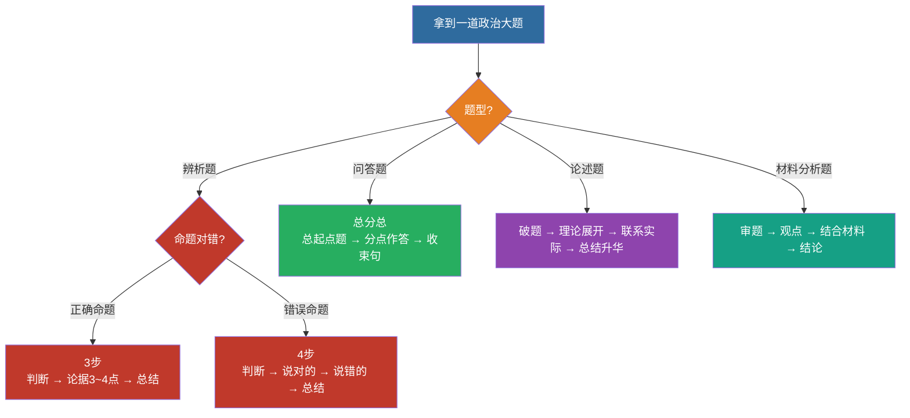

# 17 辨析题 · 问答题 · 论述题 · 材料分析题模板

> 📌 **万能骨架**：观点（教材表述）→ 展开（分点）→ 材料（"材料中……体现了……"）→ 结论（回扣设问）。四类题共用这一骨架，只是侧重不同。
>
> ⚠️ **辨析题两个铁律**：① 第一句必须判断对错（漏了可能零分）；② 第一点必须抄正确题干（1~2 分显眼包）。展开见下文第五节。

---

## 一、辨析题（判 + 析 + 结）

1. **亮明态度**：正确 / 错误 / 片面
2. **正确部分肯定**（若有）
3. **错误在哪里**（缺条件、偷换概念、因果颠倒）
4. **补全正确表述**
5. **小结**一句

示例结构：
> 该说法是错误的（或片面的）。……（原理）……。正确的说法应当是……。

---

## 二、问答题（总分总 + 分点）

1. 总起句点题
2. **1. 2. 3.** 分点，每点：观点句 + 一句展开
3. 收束句（意义/要求）

---

## 三、论述题

1. 破题：点明原理
2. 理论展开（2–4 点）
3. 联系实际 / 新时代要求
4. 总结升华（勿喊空口号，扣题）

---

## 四、材料分析题（最高频得分公式）

| 步骤 | 写法 |
|:---|:---|
| ① 审题 | 圈问题：考哪个原理？几问？ |
| ② 观点 | 先写教材规范表述 |
| ③ 结合材料 | “材料中……体现了……” |
| ④ 结论 | 回扣设问，提对策/意义 |

**万能骨架**：
> 材料体现了……原理/思想。
> 第一，……（原理点 + 材料句）。
> 第二，……。
> 因此，我们要……。

---

## 五、辨析题进阶：三种考法 × 两套步骤

> 来源：欢姐《广东专插本政治 2025 年辨析题讲解》（`BV176gY6nEb3`，2026-09-18 整理）。
> 上面第一节的「判 + 析 + 结」是通用骨架；这里是把骨架拆成**可执行的分支**——
> 拿到题先判它属于哪一种，步骤不同，写法也不同。

### 5.1 三种考法（先判类型）

| # | 考法 | 特征 | 真题锚点 |
|:--:|:---|:---|:---|
| ① | **教材原话 · 完全正确** | 直接从书上抽一句，一字不改 | 「以人为本是科学发展观的核心立场」（23 辨析） |
| ② | **张冠李戴 · 错误** | 把 A 的表述安到 B 头上，两个概念混搭 | 「毛泽东思想活的灵魂 = 统一战线、武装斗争、党的建设」（23 辨析） |
| ③ | **表述错误 · 错误** | 原句本身被篡改，常表现为**以偏概全** | 「毛泽东思想**只是**中国革命的科学指南」（20 辨析） |

> **为什么不能靠押题**：① 类就是原书原句，押不到。只能把知识点复习细。

### 5.2 两套答题步骤（关键：正确 / 错误不一样）

**正确命题（3 步）**

1. 判断对错 —— 「题干说法正确」
2. 给出论据，阐述题干的正确性（3~4 点）
3. 总结 —— 「因此，题干说法正确」

**错误命题（4 步）**

1. 判断对错
2. 把**对的**说一遍
3. 把**错的**说一遍（张冠李戴的，要先把「张」分析完再分析「李」）
4. 总结 —— 「因此，题干说法错误」

> ⚠️ **第一步「判断对错」是生死线。** 漏掉它，改卷严一点**直接零分**——不是扣一分。
> 实在判断不出，也要写一句态度，写了总比空着强。

### 5.3 ★「显眼包得分点」—— 最容易被省掉的分

**无论对错，第一点都要把「正确的题干原样抄一遍」，放在最显眼的位置。**

- **为什么**：阅卷老师手上**只有你的答卷，没有题干**。你不抄，他无法确认你在论证什么。
- **值多少**：1~2 分，白给。
- **常见误区**：觉得「抄题干不是废话吗」——**不是**，就是要抄。
- 顺序也重要：**必须放第一点**，不能塞在中间。

### 5.4 关系题破题法（高频）

看到「**A 与 B 的关系**」这种设问，按这个顺序拆：

1. **「关系」必涉及两个主体** → 先把主体定位出来
   （例：「马克思主义中国化时代化的理论成果」→ 毛泽东思想 + 中国特色社会主义理论体系。
   教材名《毛泽东思想和中国特色社会主义理论体系概论》中间那个「**和**」字就是提示。）
2. **答个性**：前者为后者提供基本遵循 / 理论准备 / 理论前提；后者是对前者的丰富和发展
3. **答共性**：都是马克思列宁主义在中国的运用和发展……
4. **收尾回扣**：「因此，题干说法正确」

### 5.5 完整范例：第 31 题（7 分）

> **题干**：马克思主义中国化时代化的理论成果是一脉相承又与时俱进的关系。

**答：题干说法正确。**（1 分）

1. 马克思主义中国化时代化的理论成果是一脉相承又与时俱进的关系。（2 分）
   —— *抄题干，拿满这 2 分*
2. 一方面，毛泽东思想为中国特色社会主义理论体系提供了基本遵循；另一方面，中国特色社会主义理论体系进一步丰富和发展了毛泽东思想。（2 分）
   —— *个性*
3. 毛泽东思想和中国特色社会主义理论体系，都是马克思列宁主义在中国的运用和发展，都以独创性的理论成果丰富和发展了马克思主义的理论宝库，同马克思列宁主义一起，都是党和国家必须长期坚持的指导思想，是全国各族人民团结奋斗的共同思想基础。**因此，题干说法正确。**（2 分）
   —— *共性 + 总结*

**结构复盘的三个钩子**：判断（1 分）→ 抄题干 + 个性 + 共性（各 2 分）→ 总结句。

### 5.6 自查清单（写完对一遍）

- [ ] 第一句写了「题干说法正确 / 错误」吗？（漏 = 可能零分）
- [ ] 第一点抄了正确题干吗？（1~2 分的显眼包）
- [ ] 正确命题写满 3 点了吗？错误命题「对的」「错的」都说了吗？
- [ ] 最后有「因此，题干说法…… 」收尾吗？
- [ ] 分点标号了吗？（1. 2. 3. 让阅卷老师好找）

---

## 六、闭卷挑战

限时 15 分钟：任选一则时政材料，按四步写完整答案，对照教材表述改错字与漏点。

返回：16-时事政治备考 · [政治](/posts/politics/)
