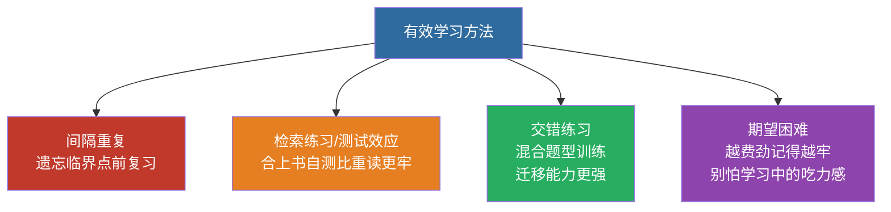

# 科学学习方法：人类实证的学习科学

> **这一页回答一个问题**：同样是每天 4–5 小时，为什么有人涨得快、有人原地打转？
> 差别通常不在「努力程度」，而在**用的方法是否被验证过有效**。
>
> 📌 **本页的规矩**：只写有**稳定实证结论**的方法，并**给出可核对的文献**；
> **不编造精确数字**（比如「提升 N%」这类，拿不出原始数据就不写）。
> 每条都按「**原理 → 机制 → 备考应用 → 常见误用**」四段写。

---

## 总表

| # | 原理 | 一句话机制 | 本站对应做法 |
|:--:|:---|:---|:---|
| 1 | **检索练习** | 从脑子里「取出」比「再读一遍」更能加固记忆 | 每章「闭卷通关训练营」；先做题再看讲解 |
| 2 | **间隔重复** | 分散到多天，比挤在一天记得牢 | 笔记 → 隔日复检 → 每周回顾；Anki 管词与错题 |
| 3 | **交错练习** | 混着练不同题型，比一类连做更能迁移 | 每日刷题科目交错混排；三法决策树 |
| 4 | **期望困难** | 过程「费力」才促成深层编码 | 撤掉脚手架答对才算掌握 |
| 5 | **自我解释** | 用自己的话讲清楚，会暴露理解漏洞 | 理由栏硬性必填，且必须是机制解释 |
| 6 | **生成效应** | 自己「生成」答案比直接看答案记得深 | 先自己回忆再对书；用新词造句 |
| 7 | **认知负荷控制** | 工作记忆容量有限，一次塞太多必然崩 | 一次只教 1 个概念；一次只留一个画面 |
| 8 | **样例学习** | 新手先看完整解答，比硬憋更高效 | 零基础先「照抄解答 → 合上默写」 |
| 9 | **睡眠巩固** | 睡眠期间大脑把短期记忆转为长期记忆 | 睡前复习 → 睡醒自测 |

---

## 为什么传统方法低效？

- 反复阅读、划重点、集中突击（"考前抱佛脚"）——**都会产生「流利错觉」：看熟了 ≠ 记住了**。
- 真正有效的学习 = **主动回忆 + 间隔重复 + 交错练习**，过程"费劲"反而记得更牢（Bjork 的"期望困难"）。

> 📌 一句话：**别反复读，要反复考自己**。

---

## 一、间隔重复（Spaced Repetition）

**原理**：在遗忘临界点重复复习，每次复习拉开间隔，记忆留存率远高于集中突击。

**机制**：遗忘曲线不是敌人，是**信号**。在"快要忘掉"的时刻复习，加固效果最好。
把 6 小时挤在一天，和分成 6 天各 1 小时，后者制造了 6 次"快要忘掉"的时机。

**关键实证**：**Cepeda, Pashler, Vul, Wixted & Rohrer (2006)**《Distributed Practice in Verbal Recall Tasks: A Review and Quantitative Synthesis》*Psychological Bulletin, 132(3)* 元分析 —— 间隔练习显著优于集中练习；间隔期与测试延迟的比例存在一个较优区间（原文讨论的是**比例关系**，不是固定天数）。

**备考应用**

- 英语词汇：Anki 每日新词 + 复习滚动。
- 政治大题：第 1 / 3 / 7 / 15 / 30 天复习同一考点。
- 本库的**复检队列**（见各科开场卡）就是间隔重复的执行清单 —— **到期就清，别攒**。

**常见误用**

- ❌ 把复检当成"重学一遍"。复检只做**提取**，不重读讲解。
- ❌ 一次清完整个队列。队列是**每天清一点**。

> 📚 检索关键词：`spacing effect`（Cepeda 等）

---

## 二、检索练习 / 测试效应（Retrieval Practice / Testing Effect）

**原理**：主动从记忆"提取"信息（自测、回忆）比被动重读更能巩固长期记忆。

**机制**：记忆不是"存进去就完事"。每一次成功**取出**，都会强化提取路径。
反复阅读带来"流畅感" —— 你以为会了，其实只是"认得出"。**认得出 ≠ 想得起**，而考试要的是后者。

**关键实证**：**Roediger & Karpicke (2006)**《Test-Enhanced Learning》*Psychological Science* —— 测试组一周后的回忆**显著高于**反复阅读组；
**Adesope et al. (2017)** 元分析（272 项研究）确认测试效应稳健。
> ⚠️ 具体提升幅度**随材料与延迟变化很大**，所以本页**不给单一百分比** —— 想看原始数字请查上述文献。

**备考应用**

- 每学完一章**合上书自测**（默写框架 / 做真题）。
- 本站在每章末设「闭卷通关训练营」就是这个用途 —— **先做，再看答案**。
- 讲义的阅读顺序应是：**先自己尝试 → 卡住 → 看解答 → 合上再做一遍**。

**常见误用**

- ❌ 把"再读一遍"当复习。第二遍的顺畅感会骗你。
- ❌ 边看答案边做 —— 那不叫提取练习，叫抄写。

> 📚 检索关键词：`testing effect`（Roediger & Karpicke）

---

## 三、交错练习（Interleaving）

**原理**：混合练习不同类型的题目（而非一章练完再练下一章），强迫大脑区分题型，迁移能力更强。

**机制**：按类型成块地练会让人误以为很熟；但真实考试**混着出题**，
你必须先判断"这题该用哪招"。交错练的正是**判断这一步**。

**关键实证**：**Rohrer & Taylor (2007)**《The shuffling of mathematics problems improves learning》*Instructional Science* —— 数学问题交错练习组在延迟测试中显著优于集中练习组。

**备考应用**

- 刷题**混科目、混题型**；本库每日刷题计划就是**科目交错混排**。
- 「极限计算三法决策树」这类页面的价值：练**选方法的判断力**，不是计算。

**常见误用**

- ❌ 用交错**替代**基础练习。刚学新概念时，先集中练几题把动作做顺，再交错。

> 📚 检索关键词：`interleaving`（Rohrer & Taylor）

---

## 四、期望困难（Desirable Difficulties）

**原理**：让学习过程稍微"费力"（回忆、变换、生成）会促进深层编码；过于顺畅的学习（重读、抄写）反而遗忘快。

**机制**：**当下的表现**和**长期的保持**不是一回事。让学习变难一点，会降低当场的流畅感，却提高长期保持 —— 所以不能拿"今天读得很顺"当学会了。

**关键实证**：**Bjork (1994)**"Instituting Desirable Difficulties"。

**备考应用**

- 不要抄笔记抄到手酸 —— 要"合上笔记复述"。
- 做题先独立思考再对答案。
- 本库纪律：**撤掉脚手架答对才算掌握**（有表格填对、撤表格答错 = 假掌握）。

**常见误用**

- ❌ 把"费劲"理解成"越难越好"。难度要**在能力边缘**，超出能力就是无效消耗。

---

## 五、自我解释 / 费曼技巧（Self-Explanation）

**原理**：用自己的话把概念讲清楚（讲给不懂的人听），暴露理解漏洞；解释过程本身就是精细加工。

**机制**：问"为什么"会强制你把新知识和已知连起来，形成更多提取线索。
反过来，**只会复述题目**（"因为这是 scanf 语句"）说明没有真正建立联系。

**关键实证**：**Chi et al. (1989)** —— 自我解释组解题成绩显著高于对照组。

**备考应用**

- 政治大题：把答案用自己的话复述一遍。
- 数学：做完题口头讲一遍思路。
- 本库纪律：**理由栏必须填**，且要是机制解释。
  例：`scanf` 要 `&` → 不是"因为语法要求"，而是"**要往盒子里写 → 得给门牌号**"。

**常见误用**

- ❌ 把"答案对"当成"懂了"。本站已用真实事故证明：**8 题数字全对，人仍说"看不下去"**。

> 📚 检索关键词：`self-explanation`、`elaborative interrogation`

---

## 六、生成效应（Generation Effect）

**原理**：自己"生成"答案比直接看答案记忆更深。

**关键实证**：**Slamecka & Graf (1978)** 提出生成效应；**Craik & Tulving (1975)** 精细加工促进记忆。

**备考应用**：背政治 —— 看标题先自己回忆内容再对书；英语 —— 用新词自己造句。

---

## 七、认知负荷控制（Cognitive Load）

**原理**：工作记忆一次只能处理**很少几个**新元素。超出容量，学习直接停摆 —— 不是"不努力"，是**容量上限**。

**机制**：所以零基础最大的敌人不是难度，是**信息密度**。

**备考应用**

- **一次只教 1 个新概念** → 立刻练 ≤3 题 → 过了才给下一个。
- **一次只留一个画面**：比喻和术语不要混排。
  真实事故：一节内容一次塞 6 层（两张票 + `%c` 不挑 + 空格 + `getchar` + 三样输入 + `'\n'` 写法），
  学生 8 题数字全对却仍说"看不下去"；**推倒只留"点餐台排队票"一个画面后，他随即答对**。
- 排版上：**主线写清楚，细节放折叠块**（本库的 `
` 就是干这个）。

**常见误用**

- ❌ 把"知识点全"当成"好讲义"。**一次给全 = 一次都没给**。
- ❌ 用"这个很简单"跳过铺垫 —— 对零基础，没有"简单"。

> 📚 检索关键词：`cognitive load theory`（Sweller）、`segmenting principle`（Mayer）

---

## 八、样例学习（Worked-Example Effect）

**原理**：对**完全的新手**，一上来就硬憋解题，效率反而低 —— 工作记忆全耗在"猜规则"上。

**机制**：先看**完整解答**再自己复现，能让新手更快抓住问题结构。
⚠️ **前提**：水平提高后样例收益下降，必须切到**自己解题**。所以是「先样例、后独立」。

**备考应用**

- **零基础阶段**：读题 → 想 30 秒 → **照抄完整解答 → 合上默写一遍**（每日刷题计划页顶部就写着这句）。
- **进阶阶段**：撤掉解答，先自己写，写完再对照。

**常见误用**

- ❌ 一直停留在"照抄"。样例是**脚手架**，撤掉还能答对才算掌握。
- ❌ 跳过"想 30 秒"直接看答案 —— 那 30 秒的失败尝试本身就在建立问题表征。

> 📚 检索关键词：`worked example effect`（Sweller）、`expertise reversal effect`

---

## 九、睡眠与记忆巩固（Sleep & Consolidation）

**原理**：睡眠期间大脑把短期记忆转为长期记忆（海马体重放）；熬夜刷题 = 白刷一半。

**关键实证**：**Walker & Stickgold (2004/2005)** 系列研究 —— 睡眠后记忆保持显著更好。

**备考应用**：保证 7–8 小时睡眠；重要内容**睡前复习、睡醒回忆**。

**常见误用**

- ❌ 用熬夜换时长。那是**用记忆质量换时间**，通常亏。

---

## 十、纪律 ↔ 原理对照（本库的规矩为什么这么定）

| 本库纪律 | 背后原理 |
|:---|:---|
| 一次只教 1 个新概念 | 认知负荷控制 |
| 一次只留一个画面，比喻术语不混排 | 认知负荷控制 |
| 判卷先看过程、后看数字 | 自我解释 |
| 理由循环论证按未过 | 自我解释 |
| 每讲完一节必问"哪句话看不懂" | 自我解释 + 检索练习 |
| 闭卷挑战、先做后看 | 检索练习 |
| 隔日复检、复检队列 | 间隔重复 |
| 每日刷题科目交错混排 | 交错练习 |
| 零基础先"照抄解答→合上默写" | 样例学习 |
| 撤掉脚手架答对才算掌握 | 样例学习（撤除）+ 期望困难 |
| 相邻两题答案刻意错开 | 交错练习的探针（防"搬上一题答案"的假会） |

---

## 十一、组合成备考日课表

| 时段 | 任务 | 应用的方法 |
|:---|:---|:---|
| **开课** | 先清**复检队列**（到期项），清完再开新内容 | 间隔重复 |
| 早 30 分钟 | 英语 Anki（新词 + 复习滚动） | 间隔重复 + 检索练习 |
| 上午 2 小时 | 高数新章节（一次 1 概念）→ 交错刷题 | 分散学习 + 交错练习 + 认知负荷 |
| 下午 1.5 小时 | 政治：读一章 → 合书自测框架 | 检索练习 + 自我解释 |
| 晚 1 小时 | 英语阅读/完形真题 1 篇 + 复盘 | 测试效应 + 精细加工 |
| **收课** | 合上讲义白纸默写今日关键结论 | 检索练习 |
| **落账** | 看板 / 学习日志 / 错题本 / 开场卡 四件事 | —— |
| 睡前 15 分钟 | 回顾当日重点，写 3 条"我能讲清楚"的知识 | 睡眠巩固 + 自我解释 |
| **次日** | 先复检昨天那节课，再开新的 | 间隔重复 |
| **每周** | 交错刷一套混合题（科目交错、题型交错） | 交错练习 |

---

## 十二、避坑清单

| ❌ 低效 | ✅ 高效 |
|:---|:---|
| 反复划线 / 重读教材 | 合书回忆 + 自测 |
| 集中突击（考前一周） | 每天分散学 |
| 按专题刷完再换 | 交错混合刷题 |
| 抄笔记抄到手酸 | 讲给别人听（自我解释） |
| 熬夜背书 | 保证睡眠 + 睡前复习 |
| 直接看答案 | 先独立做再对答案 |
| 用"看完多少页"当进度 | 用"合上资料还能答对多少"当进度 |
| 打磨工具 / 面板当学习 | 工具时间**单独记账**，不混进学习时长 |

> ⚠️ **本页不写的东西**：不写「某学习法提升 N%」这类拿不出原始数据的数字；
> 不写「学霸都在用」这类诉诸权威的话。**想知道具体数字，请按每节的检索关键词自己查原文。**

---

## 工具汇总

| 工具 | 用途 |
|:---|:---|
| **Anki** | 间隔重复卡片（英语词汇、政治考点、数学公式） |
| Obsidian / 本库 | 知识管理 + 双向链接（笔记 → 真题） |
| 番茄钟 App | 专注节奏 |
| 真题卷 | 检索练习 + 全真模拟 |

---

← [考试概况与科目结构](/posts/resources/考试概况与科目结构) · [官方教材与参考书清单](/posts/resources/官方教材与参考书清单) · [零基础学习路线图](/posts/resources/零基础学习路线图) · [考纲覆盖与练习对照表](/guide/考纲覆盖与练习对照表)
