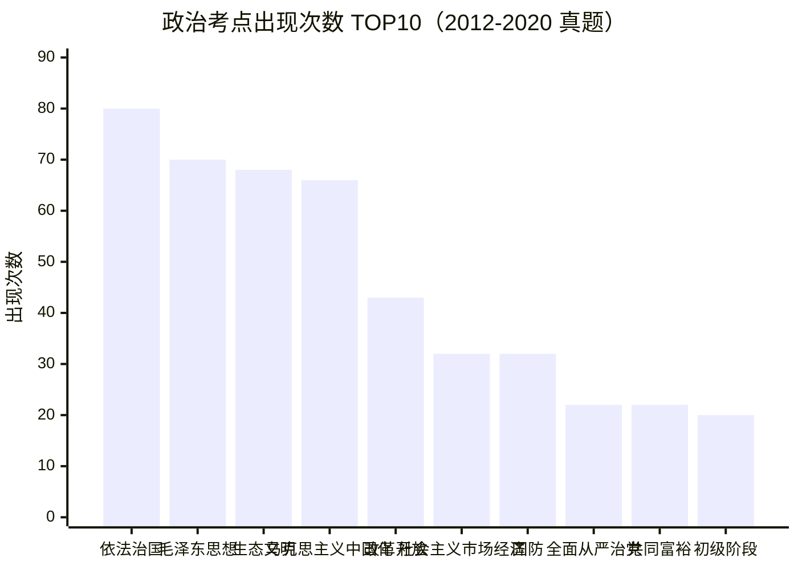

# 政治理论 · 高频考点 TOP20（已归档）
> ⚠️ **本页已被 [★ 真题考点总析（2018–2026）](真题考点总析) 取代。**
> 本页数据源为政治 2012-2019 + 2020，用**关键词频次**统计，未按分值加权，
> 也未覆盖 2021–2026。保留作历史参考；做复习规划请看 [真题考点总析](真题考点总析)。

> 统计源：政治 2012-2019 历年试卷合集 + 2020 真题（文字层/OCR 提取）

| 排名 | 考点 | 出现次数 |
|:---:|:---|:---:|
| 1 | 依法治国 | 80 |
| 2 | 毛泽东思想 | 70 |
| 3 | 生态文明 | 68 |
| 4 | 马克思主义中国化 | 66 |
| 5 | 改革开放 | 43 |
| 6 | 社会主义市场经济 | 32 |
| 7 | 国防 | 32 |
| 8 | 全面从严治党 | 22 |
| 9 | 共同富裕 | 22 |
| 10 | 社会主义初级阶段 | 20 |
| 11 | 新民主主义革命 | 16 |
| 12 | 一国两制 | 13 |
| 13 | 社会主义改造 | 12 |
| 14 | 习近平新时代中国特色社会主义思想 | 12 |
| 15 | 科学发展观 | 9 |
| 16 | 社会主义核心价值 | 7 |
| 17 | 统一战线 | 4 |
| 18 | 人民民主 | 4 |
| 19 | 邓小平理论 | 3 |
| 20 | 五大发展理念 | 1 |

> 📌 **依法治国（80）** 断层第一，毛泽东思想（70）+ 生态文明（68）+ 马克思主义中国化（66）紧随其后——**政治理论四条主线**：法治、思想、生态、中国化。

---

## ⚠️ 使用这份统计前必读

1. **这是「关键词命中次数」，不是「考点出现次数」。**
   做法是在真题文本里搜关键词。一个词出现 80 次，可能只是它**在题干/选项里反复出现**，
   不代表「考了 80 道题」。**只能用来排相对优先级，不能当考频绝对值。**

2. **「次数低」不等于「不考」。** 本表是关键词命中，而很多考点**不会以字面词出现在题干里**
   —— 如「三个代表」「和谐社会」「中国梦」等表述，可能只以材料/背景形式出现，会被低估。
   → **排在后段 ≠ 可以跳过。**

3. **样本年份有限，别据此押题。** 每份文件开头的「统计源」写明了覆盖范围。

4. **本表只做「排序参考」。** 复习顺序还要叠加：考纲权重 + 老师强调 + 你自己做题的错处。
