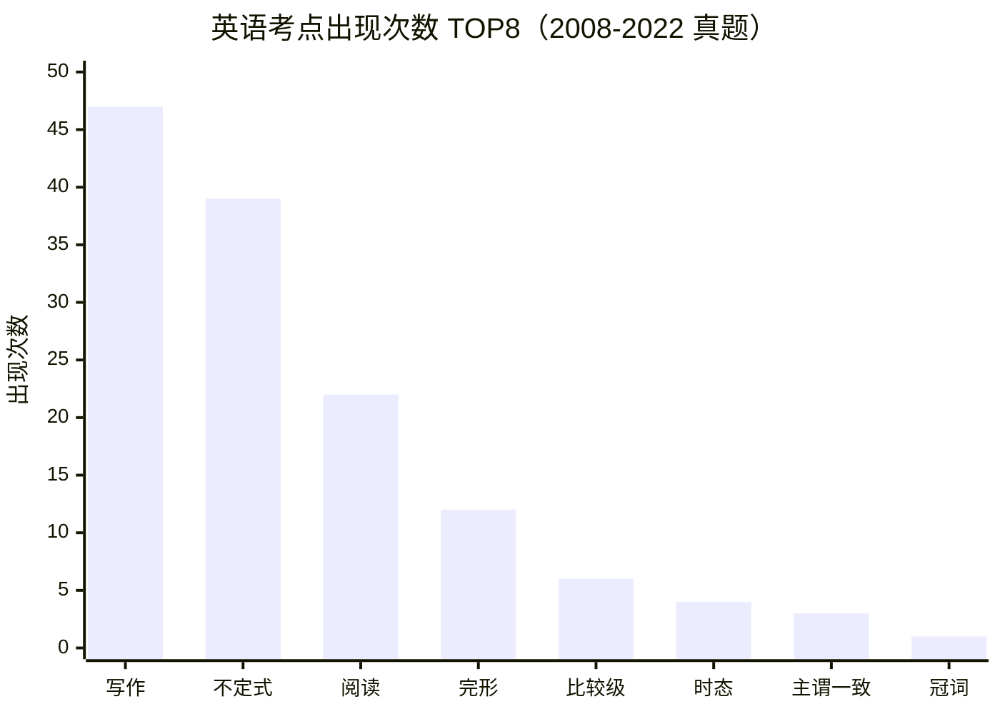

# 公共英语 · 高频考点 TOP20（已归档）
> ⚠️ **本页已被 [★ 真题考点总析（2018–2026）](真题考点总析) 取代。**
> 本页数据源为英语 2008-2022，用**关键词频次**统计，未按分值加权，也未覆盖 2023–2026；
> 且未反映 **2022 年题型改革**（取消词汇语法 30 分单选，新增语法填空 15 + 七选五 10）。
> 保留作历史参考；做复习规划请看 [真题考点总析](真题考点总析)。

> 统计源：英语 2008-2022 真题集（文字层提取）

| 排名 | 考点 | 出现次数 |
|:---:|:---|:---:|
| 1 | 写作 | 47 |
| 2 | 不定式 | 39 |
| 3 | 阅读理解 | 22 |
| 4 | 完形填空 | 12 |
| 5 | 比较级 | 6 |
| 6 | 时态 | 4 |
| 7 | 主谓一致 | 3 |
| 8 | 冠词 | 1 |
| 9 | 被动语态 | 0 |
| 10 | 虚拟语气 | 0 |
| 11 | 非谓语动词 | 0 |
| 12 | 动名词 | 0 |
| 13 | 分词 | 0 |
| 14 | 定语从句 | 0 |
| 15 | 名词性从句 | 0 |
| 16 | 状语从句 | 0 |
| 17 | 倒装 | 0 |
| 18 | 介词 | 0 |
| 19 | 固定搭配 | 0 |
| 20 | 情态动词 | 0 |

> 📌 **结论**：写作（47）+ 不定式（39）+ 阅读（22）+ 完形（12）= **120 次，占 TOP8 总量 89.6%**（120 ÷ 134）——复习重心应压在这四项上。

---

## ⚠️ 使用这份统计前必读

1. **这是「关键词命中次数」，不是「考点出现次数」。**
   做法是在真题文本里搜关键词。一个词出现 80 次，可能只是它**在题干/选项里反复出现**，
   不代表「考了 80 道题」。**只能用来排相对优先级，不能当考频绝对值。**

2. **「0 次」不等于「不考」，更可能是「关键词没匹配上」。**
   典型：本表 `被动语态` / `虚拟语气` / `定语从句` 等显示 0 —— 这在英语考试里**不可能**。
   真实原因是这些语法点**不会以字面词出现在英文题干里**。
   → **凡是 0，请当成「本次统计没抓到」，而不是「不考」。**

3. **样本年份有限，别据此押题。** 每份文件开头的「统计源」写明了覆盖范围。

4. **本表只做「排序参考」。** 复习顺序还要叠加：考纲权重 + 老师强调 + 你自己做题的错处。
