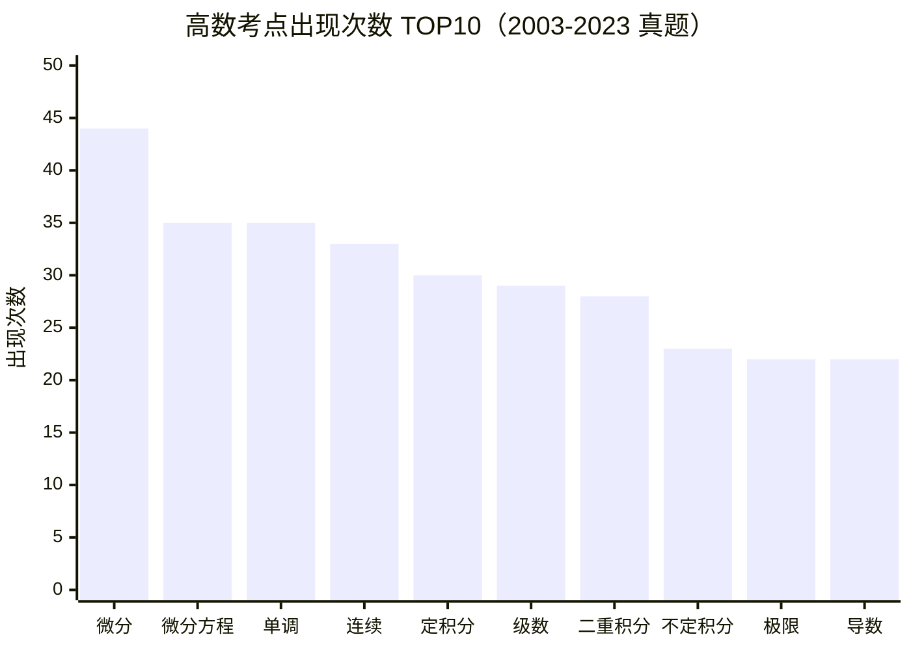

# 高等数学 · 高频考点 TOP20（已归档）
> ⚠️ **本页已被 [★ 真题考点总析（2018–2026）](真题考点总析) 取代。**
> 本页数据源为高数 2003-2023，统计的是**关键词命中次数**（不是考点出现次数），
> 未按分值加权，也未覆盖 2024–2026。保留作历史参考；做复习规划请看 [真题考点总析](真题考点总析)。

> 统计源：高数 2003-2023 历年试卷合集（文字层提取）

| 排名 | 考点 | 出现次数 |
|:---:|:---|:---:|
| 1 | 微分 | 44 |
| 2 | 微分方程 | 35 |
| 3 | 单调 | 35 |
| 4 | 连续 | 33 |
| 5 | 定积分 | 30 |
| 6 | 级数 | 29 |
| 7 | 二重积分 | 28 |
| 8 | 不定积分 | 23 |
| 9 | 极限 | 22 |
| 10 | 导数 | 22 |
| 11 | 体积 | 15 |
| 12 | 多元函数 | 13 |
| 13 | 面积 | 13 |
| 14 | 渐近线 | 11 |
| 15 | 极值 | 9 |
| 16 | 无穷小 | 9 |
| 17 | 隐函数 | 9 |
| 18 | 间断 | 7 |
| 19 | 凹凸 | 6 |
| 20 | 参数方程 | 5 |

> 📌 **微分（44）** 和 **微分方程（35）** 是绝对王者——微分+定积分+不定积分=97 次，占 TOP10 约 33%。

---

## ⚠️ 使用这份统计前必读

1. **这是「关键词命中次数」，不是「考点出现次数」。**
   做法是在真题文本里搜关键词。一个词出现 80 次，可能只是它**在题干/选项里反复出现**，
   不代表「考了 80 道题」。**只能用来排相对优先级，不能当考频绝对值。**

2. **「次数低」不等于「不考」。** 本表是关键词命中，而很多考点**不会以字面词出现在题干里**
   —— 如「夹逼」「洛必达」「罗尔定理」「拉格朗日」等解法名，题干只给式子不写名字，会被严重低估。
   → **排在后段 ≠ 可以跳过。**

3. **样本年份有限，别据此押题。** 每份文件开头的「统计源」写明了覆盖范围。

4. **本表只做「排序参考」。** 复习顺序还要叠加：考纲权重 + 老师强调 + 你自己做题的错处。
